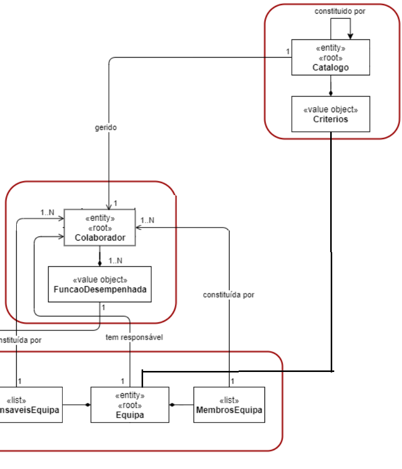

# USDemo1
=======================================

# 1. Requisitos

- US2001 (issue04) - Como Gestor de Serviços de Help desk (GSH), eu pretendo criar um novo catálogo de serviços.

O que nos retirados do caderno de encargo foi que a criação de um catalogo tem que ocorrer na aplicação console destinada aos recursos humanos, limitando assim a sua execução as pessoas que tem acesso (sendo do departamento de recursos humanos).
Existem dependencias na criação do Catalogo pois para ele estar completamente criado é preciso ter instanciado equipas, colaboradores e niveis de criticidade onde poderemos escolher qual são os mais apropriados a suar.

Estas issues são:
	2051 - Registar Colaborador
	2052 - Registar Equipa
	2010 - Definir o SLA

A interpretação feita deste requisito foi no sentido de existir mecanismos de criação e disponibilização de catálogos que serviram como agrupadores de novos catálogos ou serviços dos quais os utilizadores podem solicitar.

## 1.1 Regras de Negócio

* Um catálogo disponibiliza um ou mais serviços
* No futuru, um catálogo pode disponibilizar um ou mais catalogos
* Possui pelo menos um responsavel (ou seja um catalogo pode ter um ou mais responsaveis)
* Caracteriza-se por um identificador, por um título, por uma descrição breve e outro mais completa, um ícone
* Contem um criterio de acesso (lista de equipes que tem acesso ao catalogo)

# 2. Análise

# 2.1 Definição

Catálogo de Serviços: forma através da qual se organiza os serviços disponibilizados pelo sistema e a partir da qual se determina o público-alvo desses serviços, i.e., quem pode requer os mesmos.

# 2.2 Conceito

Neste contexto, um catálogo disponibiliza um ou mais serviços e possui pelo menos um colaborador que é responsável pela prestação desses Serviços. Por exemplo, o catálogo de “Reportar Erro / Falha” pode compreender os seguintes serviços:
	• “Reportar anomalia de comunicação”;
	• “Reportar anomalia em equipamento”;
	• “Reportar anomalia em aplicação”.
Nota: o catalogo deve conseguir contem mais catalogos mas essa funcionalidade não é solicitada neste momento.

Ou seja, ao disponibilizamos esta funcionalidade, estaremos a permitir que determinados colaboradores criem e partilhem catalogo para outras equipas.

## 2.3 Modelo de Domínio

# 3. Design

## 3.1. Realização da Funcionalidade

*Inserir o modelo de dominio*

## 3.2. Diagrama de Classes

## 3.3. Padrões Aplicados

|--------------|----------------------------------------------------|
|  **Padrão**  | **Observações**		                     		|
|--------------|----------------------------------------------------|
| Factory      | Padrão utilizado para atribuir a responsabilidade  |
|              | de criar objetos a uma classe particular. 			|
| Repository   | Padrão utilizado para persistir os objetos criados.|
| MVC   	   | Padrão utilizado para a UI e Controllers. 			|
|--------------|----------------------------------------------------|

## 3.4. Testes 

**Teste 1:** * Após associação de um colaborador a lista de responsaveis, a lista de responsaveis deve conter esse colaborador

**Teste 2:** * Os colaboradores da lista de responsaveis tem de conseguir alterar os dados de um catalogo

**Teste 3:** * Após associação de uma equipa a lista de criterios, a lista de criterios deve conter essa equipa

**Teste 4:** * Os colaboradores que pertencem as equipas que estao na lista de criterios tem que conseguir ver este catalogo e conseguir solicitar os servicos contidos nele

# 4. Implementação

*Nesta secção a equipa deve providenciar, se necessário, algumas evidências de que a implementação está em conformidade com o design efetuado. Para além disso, deve mencionar/descrever a existência de outros ficheiros (e.g. de configuração) relevantes e destacar commits relevantes;*

*Recomenda-se que organize este conteúdo por subsecções.*

# 5. Integração/Demonstração

*Nesta secção a equipa deve descrever os esforços realizados no sentido de integrar a funcionalidade desenvolvida com as restantes funcionalidades do sistema.*

# 6. Observações

*Nesta secção sugere-se que a equipa apresente uma perspetiva critica sobre o trabalho desenvolvido apontando, por exemplo, outras alternativas e ou trabalhos futuros relacionados.*