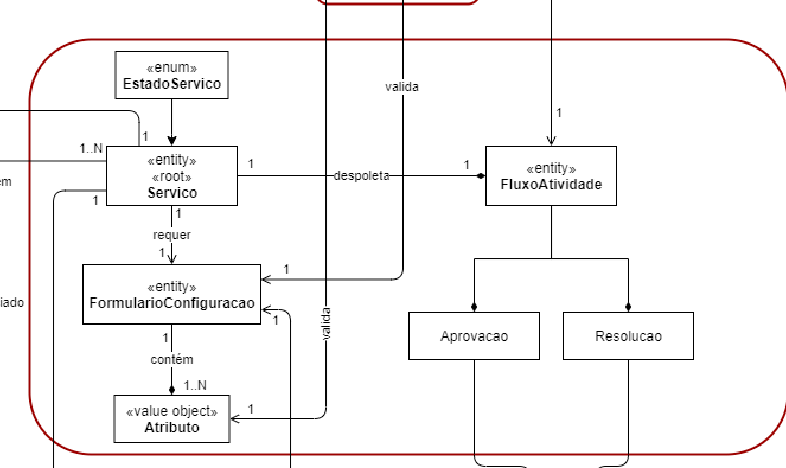
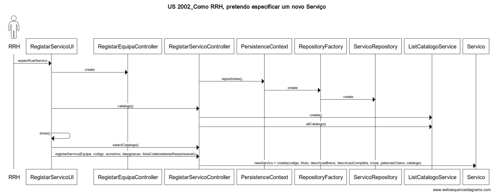
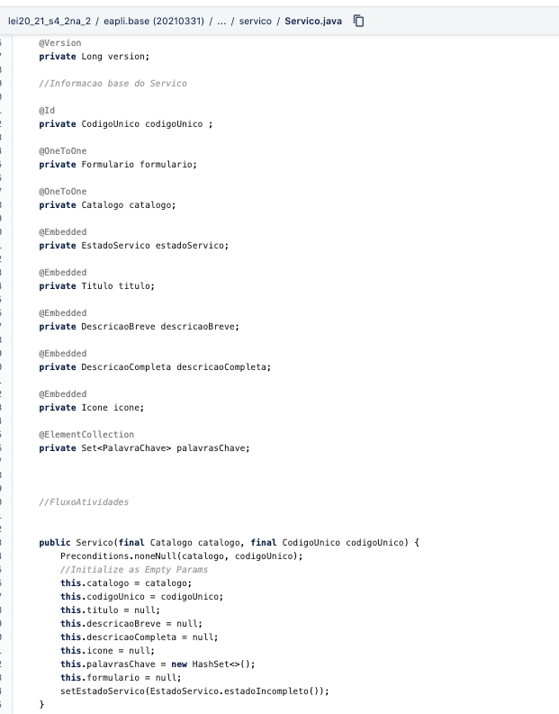

# 2002 - Registar um novo Servico
=======================================

# 1. Requisitos

- US 2002 -  Como GSH, eu pretendo proceder à especificação de um novo serviço, devendo o sistema permitir que a mesma fique incompleta e seja, posteriomente, retomada.

A interpretação feita deste requisito foi no sentido de em que apenas o Gestor de Serviços de Help desk pode especificar um novo serviço.
Existem dependências com a 2001 - Como GSH, eu pretendo criar um novo catálogo de serviços, pois na sua criação é necessário associar um catálogo.

## 1.1 Regras de Negócio
O serviço só deve ficar disponivel para solicitação quando a sua especificação ficar completa e válida.
Apenas informação base do serviço (código, descrição, catálogo onde será disponibilizado, formulários, requer feedback).
o sistema permitir que o processo den registo fique   "incompleta" e seja posteriomente, retomado;

# 2. Análise

O GSH, é o responsável pela especificação de Serviços.
Um Serviço é constituido por:
* Um Catalogo ao qual pertence 
* Um Codigo Unico que o identifica o sistema 
* Um Titulo de identificaçao
* Uma descriçao breve 
* Uma descrição completa 
* Um Icone 
* Um conjunto de Palavras Chave para facilitar a sua pesquisa
* Um Fluxo de Atividades
* Um Formulário de solicitação de serviço constituido por:

Um Formulário é constituido por:
* Identificador Unico
* Uma lista de Atributos 
* Um Script Para a sua validação

Um Atributo é definido por :
* Nome;
* Titulo(Label);
* Descricao para ajuda e preenchimento ;
* Um tipo de dados (Inteiro , Booleano ...);
* Uma expressão regular que permita a sua validaação;

Para continuar a especificação de um serviço foi denfindo um estado  de "incompleto" ou "Publicado";
A continuação da especificação de um serviço é assumido como um caso de uso à parte;

## 2.1 Modelo de Domínio

# 3. Design

## 3.1 Realização da Funcionalidade

## 3.3 Padrões Aplicados

| **Padrão**	   | **Observações**			|
|--------------|--------------------------------|
| Factory      | Padrão utilizado para atribuir a responsabilidade de criar objetos a uma classe particular. |
| Repository   | Padrão utilizado para persistir os objetos criados. |
| MVC   	   | Padrão utilizado para a UI e Controllers. |

## Padrão Repository

Este padrão foi aplicado para se obter a lista de Tipos de Envolventes que o sistema já tem disponível (persistido) e, posteriormente, obter o Tipo de envolvente escolhido pelo analista de risco para a envolvente que está a criar.  
Para este caso, o sistema necessita de aceder aos Tipos de Envolvente já persistidos no sistema, utilizando para o efeito uma classe cuja responsabilidade é abstrair a camada da persistencia, passando a ser ela responsável por mediar a cação entre a camada de domínio e a camada da persistência.

## Padrão Strategy

Este padrão foi aplicado no caso específico da obtenção das coordenadas GPS e da imagem aérea centrada na envolvente a partir do serviço de Georreferenciação. Para este caso, o sistema é capaz de, mediante a especificação prévia no ficheiro de configurações, escolher qual o "provider" que deve utilizar para obter a resposta ao pedido de georeferenciação feito - Google ou Bing.
Este padrão foi implementado recorrendo a uma interface GeoReferenciacaoService que é implementada em cada uma das classes concretas que dispobilizam as implementações para cada um dos serviço - GeoReferenciacaoFromGoogleService, GeoReferenciacaoFromBingService.
É possivel ver-se na imagem seguinte um diagrama de classes simplificado que exemplifica o que foi mencionado.

## Padrão Factory

Este padrão foi utilizado no caso específico da criação de uma envolvente.
Neste caso especifico, o sistema disponibiliza a possibilidade de instanciar um objeto do tipo Envolvente através de uma Factory de Envolventes. A aplicação deste tipo de padrão, entre outras, apresenta a vantagem de permitir encapsular as regras do domínio.

## Padrão Builder 
Este padrão foi utilizado no para a Criação de um Serviço , sendo a construçao deste complexa,  envolvendo alguma complexidade, e fazeada. O builder permite isolar estes mesmos problemas na sua construção 

|--------------|----------------------------------------------------|
|  **Padrão**  | **Observações**		                     		|
|--------------|----------------------------------------------------|
| Factory      | Padrão utilizado para atribuir a responsabilidade  |
|              | de criar objetos a uma classe particular. 			|
| Repository   | Padrão utilizado para persistir os objetos criados.|
| MVC   	   | Padrão utilizado para a UI e Controllers. 			|
|--------------|----------------------------------------------------|
## 3.4 Testes

De forma a aferir uma correta satisfação dos requisitos da US foram concebidos os seguintes testes:

**Teste 1:** Na lista de equipas, deverá conter a nova equipa criada.
**Teste 2:**  Criar Servico Apenas Com informaçao Base
**Teste 3:**  Criar Servico sem Aprovacao
**Teste 4:**  Criar Servico com aprovacao
**Teste 5:**  Criar Servico Resolucao Manual
**Teste 6:**  Criar Servico Resolucao Automatica

# 4. Implementação
## 4.1 Classe Serviço

## 4.2 Classe RegistarServicoController

# 5. Integração/Demonstração

*Este caso de uso foi integrado no sistema  previamente desenvolvido na disciplina de EAPLI, como uma funcionalidade disponível para os GSH.

# 6. Observações
