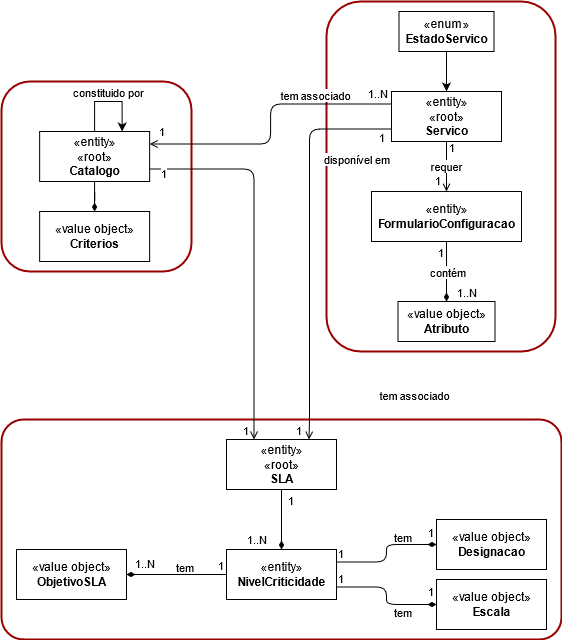
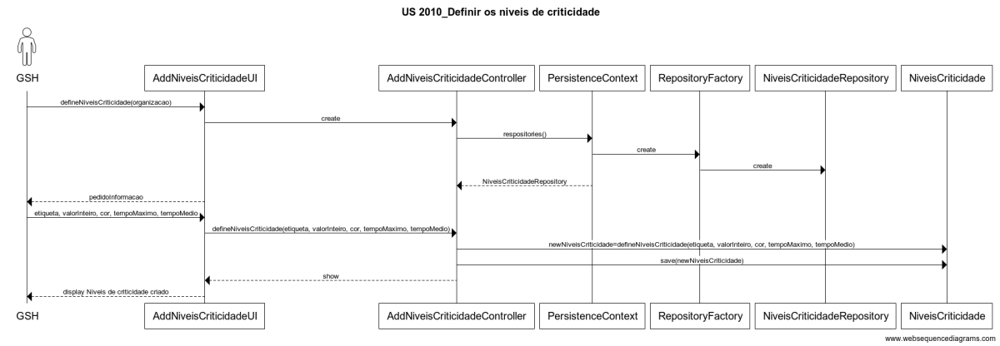

# 2010 - Definir Niveis de Criticidade SLA
=======================================

# 1. Requisitos

- US 2010 - Como GSH, eu pretendo definir os niveis de criticidade e respetivos objetivos aplicados na organização para definição de SLAs.

A interpretação feita deste requisito foi no sentido de em que apenas o gestor dos serviço de Help Desk pode definir Niveis de Criticidade SLA.

## 1.1 Regras de Negócio

* Definidos por:
	- uma etiqueta(ex.baixa, média, alta)
	- um valor numa escala numérica de inteiros
	- uma cor indicativa de gravidade
	- objetivos (ie. os tempos maximos e médios a serem satisfeitos tanto na aprovação como na resolução de uma solicitação)

# 2. Análise

O colaborador que desempenha a função de gestor dos serviço de Help Desk, é o responsável pela definição dos Niveis de Criticidade SLA.

## 2.1 Modelo de Domínio

# 3. Design

## 3.1 Realização da Funcionalidade

## 3.3 Padrões Aplicados

| **Padrão**	   | **Observações**			|
|--------------|--------------------------------|
| Factory      | Padrão utilizado para atribuir a responsabilidade de criar objetos a uma classe particular. |
| Repository   | Padrão utilizado para persistir os objetos criados. |
| MVC   	   | Padrão utilizado para a UI e Controllers. |

## 3.4 Testes

De forma a aferir uma correta satisfação dos requisitos da US foram concebidos os seguintes testes:

**Teste 1:** Após a criação de um novo nivel de criticidade, esta deverá aparecer no repositório.

**Teste 2:** Validação dos tipos de dados inseridos.

# 4. Implementação

*Nesta secção a equipa deve providenciar, se necessário, algumas evidências de que a implementação está em conformidade com o design efetuado. Para além disso, deve mencionar/descrever a existência de outros ficheiros (e.g. de configuração) relevantes e destacar commits relevantes;*

*Recomenda-se que organize este conteúdo por subsecções.*

# 5. Integração/Demonstração

*Nesta secção a equipa deve descrever os esforços realizados no sentido de integrar a funcionalidade desenvolvida com as restantes funcionalidades do sistema.*

# 6. Observações

*Nesta secção sugere-se que a equipa apresente uma perspetiva critica sobre o trabalho desenvolvido apontando, por exemplo, outras alternativas e ou trabalhos futuros relacionados.*
