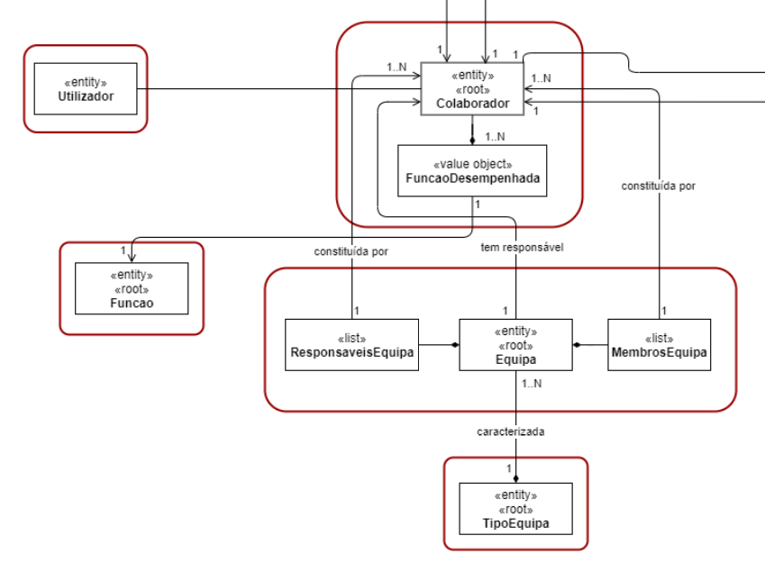

# 2052 - Registar nova equipa
=======================================

# 1. Requisitos

- US 2052 - Como RRH, eu pretendo criar uma nova equipa.

A interpretação feita deste requisito foi no sentido de em que apenas o responsável de recursos humanos pode criar uma nova equipa. 
Existem dependências com a US 2052 - Registar Tipo de Equipa, pois na sua criação é necessário associar um tipo de equipa.

## 1.1 Regras de Negócio

* Uma equipa pode ter um ou mais responsáveis
* Uma equipa pode ter um ou mais colaboradores
* Uma equipa pode ser constituída por um colaborador onde este é o responsável.

# 2. Análise 

O colaborador que desempenha a função de Responsável de Recursos Humanos, é o responsável pela criação das equipas. Uma Equipa é constituída por uma lista de colaboradores (Membros da Equipa) e uma lista de responsáveis, que podem ser um ou mais colaboradores. Na sua criação, o RRH deverá caracterizar a Equipa com um Tipo de Equipa.

## 2.1 Modelo de Domínio

## 2.2 Testes

De forma a aferir uma correta satisfação dos requisitos da US foram concebidos os seguintes testes:

**Teste 1:** Após associação de um responsável a uma equipa, a lista de responsáveis deverá conter esse responsável.

**Teste 2:** A lista de responsáveis não pode ser vazia.

**Teste 3:** Testar os values objects

# 3. Design 

## 3.1 Realização da Funcionalidade

## 3.3 Padrões Aplicados

| **Padrão**	   | **Observações**			|
|--------------|--------------------------------|
| Factory      | Padrão utilizado para atribuir a responsabilidade de criar objetos a uma classe particular. |
| Repository   | Padrão utilizado para persistir os objetos criados. |
| MVC   	   | Padrão utilizado para a UI e Controllers. |
| DTO   	   | Padrão utilizado para apresentação dos objectos. |

	
# 4. Implementação

A implementação foi seguida de acordo com o diagrama de sequência apresentado. De observar que, todos os serviços de listagem utilizados no desenvolvimento desta US, mais concretamente listar os tipos de equipa e os colaboradores, são utilizados DTOs de forma a diminuir o acoplamento entre a UI e as classes de Dominio.

A equipa decidiu que não haveria necessidade da utilização de um Builder para o registo de uma equipa.

# 5. Observações

Ainda com alguns melhoramentos a fazer, nomeadamente a relação entre colaborador e equipa onde surgem alguma dúvidas a nível da persistência. O value object Cor, pode ser um ENUM.