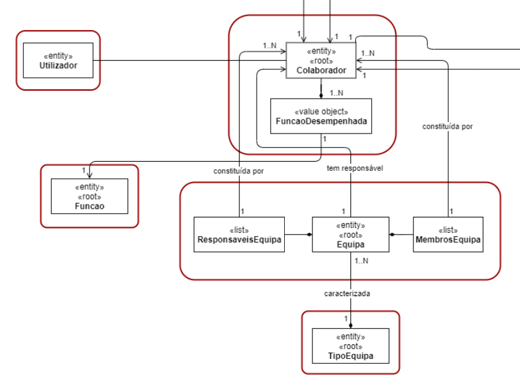
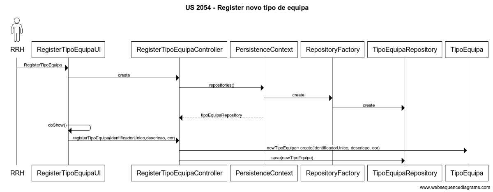

# 2054 - Registar Tipo de Equipa
=======================================

# 1. Requisitos

- US 2054 - Como RRH, eu pretendo registar um novo tipo de equipa.

A interpretação feita deste requisito foi no sentido de em que apenas o responsável de recursos humanos pode criar um novo tipo de equipa.

## 1.1 Regras de Negócio

* Uma equipa pode ter um ou mais responsáveis
* Uma equipa pode ter um ou mais colaboradores
* Uma equipa pode ser constituída por um colaborador onde este é o responsável.

# 2. Análise 

O colaborador que desempenha a função de Responsável de Recursos Humanos, é o responsável pela criação de novos tipos de equipa. Na criação de uma nova equipa, o RRH deverá caracterizar a Equipa com um Tipo de Equipa.

## 2.1 Modelo de Domínio

# 3. Design 

## 3.1 Realização da Funcionalidade

## 3.3 Padrões Aplicados

| **Padrão**	   | **Observações**			|
|--------------|--------------------------------|
| Factory      | Padrão utilizado para atribuir a responsabilidade de criar objetos a uma classe particular. |
| Repository   | Padrão utilizado para persistir os objetos criados. |
| MVC   	   | Padrão utilizado para a UI e Controllers. |

## 3.4 Testes

De forma a aferir uma correta satisfação dos requisitos da US foram concebidos os seguintes testes:

**Teste 1:** Após a criação de um novo tipo de equipa, esta deverá aparecer no repositório. 

**Teste 2:** Validação dos tipos de dados.

**Teste 3:** Na criação de uma nova equipa deverá ser possível escolher o tipo de equipa recém criado.
	
# 4. Implementação

*Nesta secção a equipa deve providenciar, se necessário, algumas evidências de que a implementação está em conformidade com o design efetuado. Para além disso, deve mencionar/descrever a existência de outros ficheiros (e.g. de configuração) relevantes e destacar commits relevantes;*

*Recomenda-se que organize este conteúdo por subsecções.*

# 5. Integração/Demonstração

*Nesta secção a equipa deve descrever os esforços realizados no sentido de integrar a funcionalidade desenvolvida com as restantes funcionalidades do sistema.*

# 6. Observações

*Nesta secção sugere-se que a equipa apresente uma perspetiva critica sobre o trabalho desenvolvido apontando, por exemplo, outras alternativas e ou trabalhos futuros relacionados.*