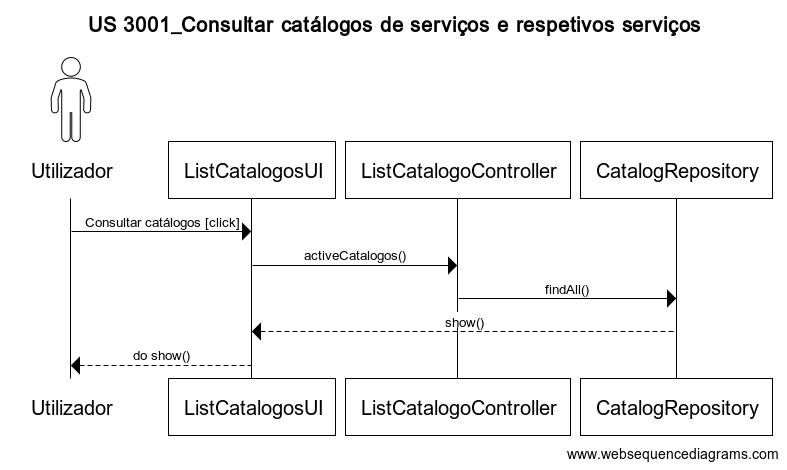
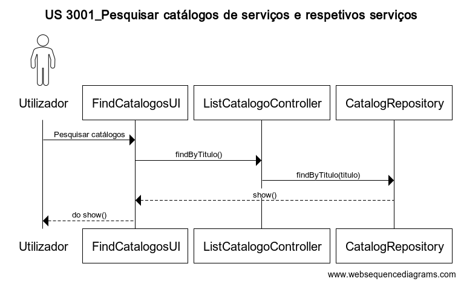

# 3001 - Pesquisar Catalogos de serviços
=======================================

# 1. Requisitos

- US 3001 - Como utilizador, eu pretendo consultar/pesquisar os catálogos de serviços e respetivos serviços que me estão/são disponibilizados.

A interpretação feita deste requisito foi no sentido de em que o utilizador tem a possibilidade de consultar/pesquisar os catálogos e respetivos serviços que lhe é disponibilizado.

## 1.1 Regras de Negócio

* Apresentar os catálogos e serviços que estão disponibilizados ao utilizador em causa
* A pesquisa deve ser orientada pelas palavras-chave dos serviço se/ou pelos respetivos títulos e os resultados agrupados pelos respetivos catálogos
* Deve permitir consultar detalhes de cada um dos resultados de pesquisar
* Os serviços cuja especificação esteja incompleta podem aparecer sinalizados coma informação "brevemente disponível"

# 2. Análise

O utilizador pretende consultar/pesquisar os catálogos de serviços e respetivos serviços que me estão/são disponibilizados.

## 2.1 Modelo de Domínio

# 3. Design

## 3.1 Realização da Funcionalidade

## 3.3 Padrões Aplicados

| **Padrão**	   | **Observações**			|
|--------------|--------------------------------|
| Repository   | Padrão utilizado para persistir os objetos criados. |
| MVC   	   | Padrão utilizado para a UI e Controllers. |

## 3.4 Testes

De forma a aferir uma correta satisfação dos requisitos da US foram concebidos os seguintes testes:

**Teste 1:** Após a criação de um novo nivel de criticidade, esta deverá aparecer no repositório.

**Teste 2:** Validação dos tipos de dados inseridos.

# 4. Implementação

*Nesta secção a equipa deve providenciar, se necessário, algumas evidências de que a implementação está em conformidade com o design efetuado. Para além disso, deve mencionar/descrever a existência de outros ficheiros (e.g. de configuração) relevantes e destacar commits relevantes;*

*Recomenda-se que organize este conteúdo por subsecções.*

# 5. Integração/Demonstração

*Nesta secção a equipa deve descrever os esforços realizados no sentido de integrar a funcionalidade desenvolvida com as restantes funcionalidades do sistema.*

# 6. Observações

*Nesta secção sugere-se que a equipa apresente uma perspetiva critica sobre o trabalho desenvolvido apontando, por exemplo, outras alternativas e ou trabalhos futuros relacionados.*
