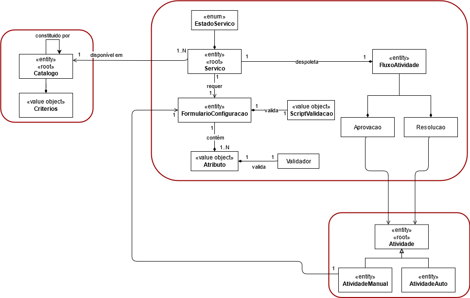
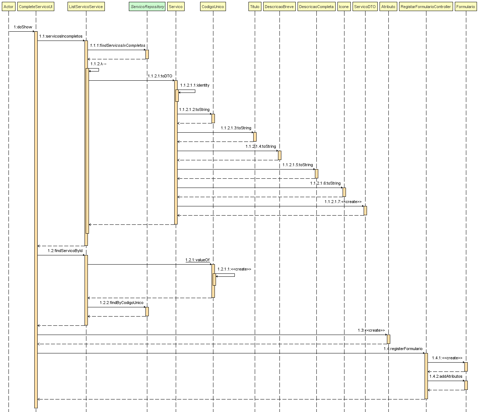

# 2003 - Continuar/completar a especificação em curso de um serviço .
=======================================


# 1. Requisitos

- 2003 - Como GSH, eu pretendo continuar/completar a especificação em curso de um serviço .

A interpretação feita deste requisito foi no sentido de em que apenas o gestor de Serviços HelpDesk Continuar a especificação em curso de um determinado serviço.

O serviço só deve ficar disponível para solicitação quando a sua especificação ficar completa e válida.
Adição de fluxos de atividade e validações dos formulários.
Deve ser utilizada a linguagem/gramática desenvolvida pela equipa.


## 1.1 Regras de Negócio

- Um serviço possui um código único, um título, uma descrição breve e outro mais completa, um ícone, um conjunto de palavras-chave (keywords) para facilitar a pesquisa e o catálogo onde é disponibilizado.
- É necessário definir os dados/informação a recolher no formulário (i) de solicitação do serviço e/ou (ii) no formulário de uma atividade manual.
- Cada formulário tem um identificador único no âmbito do serviço, um nome e uma lista de atributos a solicitar ao colaborador.
- Um atributo caracteriza-se por um nome de variável, uma etiqueta (label) de apresentação, uma descrição de ajuda, um tipo de dados base (e.g., numérico, texto, data, booleano, seleção de valores pré-definidos)e uma expressão regular que permita a sua validação local.
- O formulário  deve  ainda  ter  associado um script que  permita  proceder  à  sua validação;
- A atividade de aprovação do serviço, podendo esta ser requerida ou não.
- De momento apenas  é  necessária  contemplar  a  aprovação  pelo  responsável  hierárquico  direto  do solicitante  e/ou  pelo  responsável  do  serviço  em  causa.  Ou  seja,  não  se  pretende despender esforços na delegação de tarefas e/ou na solicitação de opinião de terceiros.
- Note-se que uma atividade destas tem um formulário associado;
- A atividade de  realização  do  serviço podendo  esta  ser  do  tipo  manual  ou  do  tipo automática.
- Note-se que uma atividade manual tem um formulário associado enquanto que uma tarefa automática tem associado um script na linguagem a definir pela equipa.
- Considerando a extensão e complexidade da informação subjacente à especificação de um serviço, pretende-se que esta possa ser feita em diferentes momentos espaçados no tempo. Nesse sentido, a especificação pode num dado momento ficar incompleta e ser, posteriormente, continuada/completada.
- Apenas serviços especificados completamente podem ser solicitados.


# 2. Análise

## 2.1 Modelo de Domínio




# 3. Design

## 3.1 Realização da Funcionalidade



## 3.2. Padrões Aplicados

| **Padrão**	   | **Observações**			|
|--------------|--------------------------------|
| Service      | Padrão utilizado para lidar com operações e coordenação de objetos de dominio
| Repository   | Padrão utilizado para persistir os objetos criados. |
| DTO   	     | Padrão utilizado para apresentação dos objectos. |


## 3.3. Testes

De forma a aferir uma correta satisfação dos requisitos da US foram concebidos os seguintes testes:

**Teste 1:** testar a edição de um serviço inexistente
**Teste 2:** testar a edição de um serviço com valores inadaptados


# 4. Implementação

- Continuar/completar a especificação em curso de um serviço .

```
public Servico registerServicoIncompleto(Catalogo catalogo, String codigoUnico, String titulo, String descricaoBreve,
																				 String descricaoCompleta, String icone, Set<PalavraChave> keywords, String cargoResponsavel, Atividade atividade) {


		builder.withCatalogo(catalogo);
		builder.withCodigoUnico(codigoUnico);
		builder.withTitulo(titulo);
		builder.withDescricaoBreve(descricaoBreve);
		builder.withDescricaoCompleta(descricaoCompleta);
		builder.withIcone(icone);
		builder.withPalavrasChaves(keywords);
		builder.withFluxoAprovacao(cargoResponsavel);
		builder.withFluxoResolucao(atividade);
		builder.withStatusIncompleted();

		Servico servico = builder.build();

		return servicoRepository.save(servico);
}

public Servico registerServicoCompleto(Catalogo catalogo, String codigoUnico, String titulo, String descricaoBreve, String descricaoCompleta, String icone, Formulario formulario) {

		authz.ensureAuthenticatedUserHasAnyOf(BaseRoles.RRH, BaseRoles.RECURSOS_HUMANO, BaseRoles.POWER_USER);

		builder.withCatalogo(catalogo);
		builder.withCodigoUnico(codigoUnico);
		builder.withTitulo(titulo);
		builder.withDescricaoBreve(descricaoBreve);
		builder.withDescricaoCompleta(descricaoCompleta);
		builder.withIcone(icone);
		builder.withFormulario(formulario);
		builder.withStatusCompleted();

		Servico servico = builder.build();

		return servicoRepository.save(servico);
}
```


# 5. Integração/Demonstração


# 6. Observações

Nada a assinalar.
