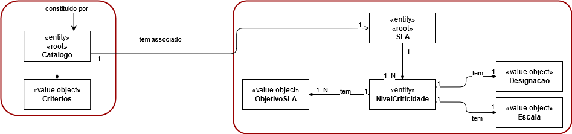
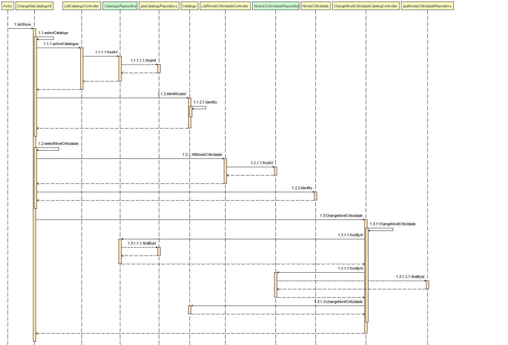
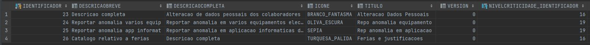

# 2012 - Atribuição de um nivel de criticidade  a um catalogo
=======================================


# 1. Requisitos

- 2012 - Como GSH, eu pretendo atribuir o nível de criticidade aplicado a um catálogo de serviços.

A interpretação feita deste requisito foi no sentido de em que apenas o gestor de Serviços HelpDesk possa atribuir um nível de criticidade a um catálogo de serviços.


## 1.1 Regras de Negócio

- A associação pode ser:
	- Básica, no sentido em que os objetivos a serem cumpridos são aqueles que constam no nível de criticidade associado;
	- Customizada,  no  sentido  em  que  os  objetivos  a  aplicar no catálogo  são  distintos  dos constantes no nível de criticidade associado, ou seja, são redefinidos localmente.


# 2. Análise

## 2.1 Modelo de Domínio




# 3. Design

## 3.1 Realização da Funcionalidade



## 3.2. Padrões Aplicados

| **Padrão**	   | **Observações**			|
|--------------|--------------------------------|
| Factory      | Padrão utilizado para atribuir a responsabilidade de criar objetos a uma classe particular. |


## 3.3. Testes

De forma a aferir uma correta satisfação dos requisitos da US foram concebidos os seguintes testes:

**Teste 1:** testar a edição de um nível de criticidade


# 4. Implementação

- Adicionar o nível de criticidade ao catalogo
```
private Catalogo registerCatalog(String titulo, String descricaoDreve, String descricaoCompleta,
																 String icone, ColaboradorDTO colaboradorDTO, NiveisCriticidadeDTO ncDTO,
																 Set<EquipaDTO> listCriterios, Calendar createdOn) {


		Colaborador responsavel = colaboradorRepository.findByUsername(colaboradorDTO.username).get();
		NiveisCriticidade nivelCriticidade = niveisCriticidadeRepository.findByEtiqueta(ncDTO.etiqueta).get();

		Set<Equipa> criterios = new HashSet<>();
		if (!listCriterios.isEmpty()) {
				listCriterios.forEach(dto->{
						criterios.add(equipaRepository.findById(dto.id).get());
				});
		}

		Catalogo catalogo = new Catalogo(new Titulo(titulo), new DescricaoBreve(descricaoDreve),
						new DescricaoCompleta(descricaoCompleta), new Icone(icone),
						responsavel, nivelCriticidade, criterios);

		CatalogoRepository catalogoRepository = PersistenceContext.repositories().catalogo();
		return catalogoRepository.save(catalogo);
}
```


- Mudar o nível de criticidade do catalogo
```
public class ChangeNivelCriticidadeCatalogController {

    private final AuthorizationService authz = AuthzRegistry.authorizationService();
    private final CatalogoRepository catalogoRepository = PersistenceContext.repositories().catalogo();
    private final NiveisCriticidadeRepository niveisCriticidadeRepository = PersistenceContext.repositories().niveisCriticidade();

    private Catalogo ChangeNivelCriticidade(Long idCatalogo, Long idNivelCriticidade, Calendar createdOn) {

        //authz.ensureAuthenticatedUserHasAnyOf(BaseRoles.RRH, BaseRoles.RECURSOS_HUMANO, BaseRoles.POWER_USER);

        Catalogo catalogo = catalogoRepository.findById(idCatalogo).get();
        NiveisCriticidade nivelCriticidade = niveisCriticidadeRepository.findById(idNivelCriticidade).get();

        catalogo.changeNivelCriticidade(nivelCriticidade);

        return catalogoRepository.save(catalogo);
    }

    public Catalogo ChangeNivelCriticidade(Long idCatalogo, Long idNivelCriticidade) {
        return ChangeNivelCriticidade(idCatalogo, idNivelCriticidade, Calendars.now());
    }
}
```


# 5. Integração/Demonstração



# 6. Observações

Nada a assinalar.
