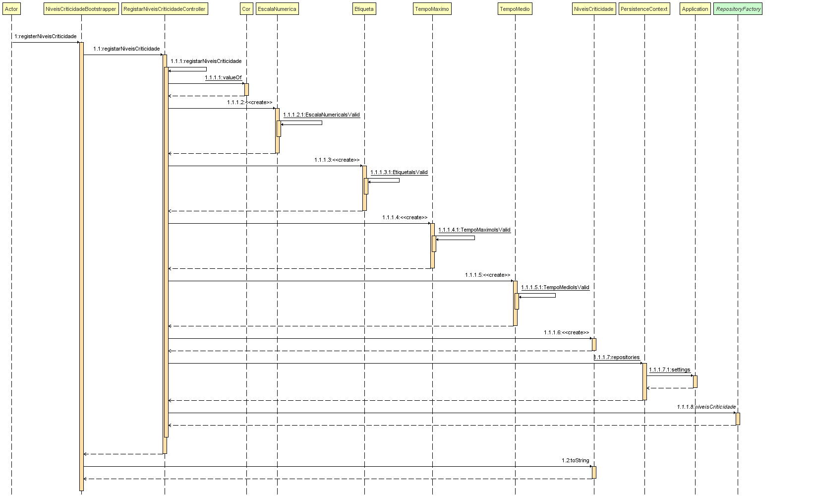
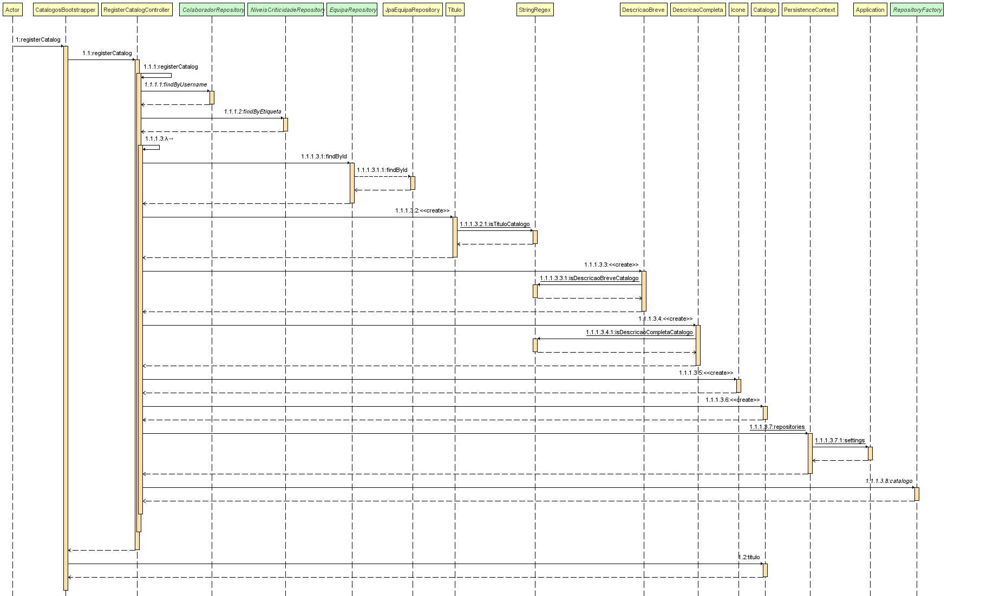

# 2105 - Bootstrap de niveis de critidade e atribuição a catálogos
==================================================================


# 1. Requisitos

- US 2105 - Como Gestor de Projeto, eu pretendo que, para efeitos de demonstração, o sistema contemple a possibilidade de ser inicializado (bootstrap) com (i) um conjunto de níveis de criticidade e respetivos objetivos aplicados pela organização e (ii) a atribuição de alguns desses níveis a catálogos de serviços.

## 1.1 Regras de Negócio

* Definidos por:
	- uma etiqueta(ex. baixa, média, alta)
	- um valor numa escala numérica de inteiros
	- uma cor indicativa de gravidade
	- objetivos (ie. os tempos máximos e médios a serem satisfeitos tanto na aprovação como na resolução de uma solicitação)


# 2. Design

## 2.1 Realização da Funcionalidade

A US encontra-se dividida em 2 partes:

Parte I - Inicialização (bootstrap) de um conjunto de níveis de criticidade e respetivos objetivos aplicados pela organização



Parte II -  Atribuição de alguns níveis de criticidade a catálogos de serviços



## 2.2. Padrões Aplicados

| **Padrão**	   | **Observações**			|
|--------------|--------------------------------|
| Factory      | Padrão utilizado para atribuir a responsabilidade de criar objetos a uma classe particular. |
| Repository   | Padrão utilizado para persistir os objetos criados. |


# 3. Implementação

```
public class NiveisCriticidadeBootstrapper implements Action {

    private static final Logger LOGGER = LoggerFactory.getLogger(UsersBootstrapperBase.class);

    @Override
    public boolean execute() {
        // Nivel de criticidade 1
        registerNiveisCriticidade( "AZUL", "12", "Medio", "12", "9");
        // Nivel de criticidade 2
        registerNiveisCriticidade(  "VERMELHO", "5", "Alto", "21", "18");
        // Nivel de criticidade 3
        registerNiveisCriticidade(  "BRANCO", "3", "Alto", "22", "13");
        // Nivel de criticidade 4
        registerNiveisCriticidade( "PRETO", "11", "Baixo", "5", "2");
        return false;
    }

    private void registerNiveisCriticidade(String cor, String escalaNumerica, String etiqueta,
                                           String tempoMaximo, String tempoMedio) {
        final RegistarNiveisCriticidadeController controller = new RegistarNiveisCriticidadeController();
        try {
            NiveisCriticidade nc = controller.registarNiveisCriticidade(cor, escalaNumerica, etiqueta, tempoMaximo, tempoMedio);
            System.out.println("Nivel de criticidade criado: " + nc.toString());
            LOGGER.debug("»»» %s", nc);
        } catch (Exception e) {
            System.out.println("Nivel de criticidade não criado: " + e);
        }
    }
}
```
