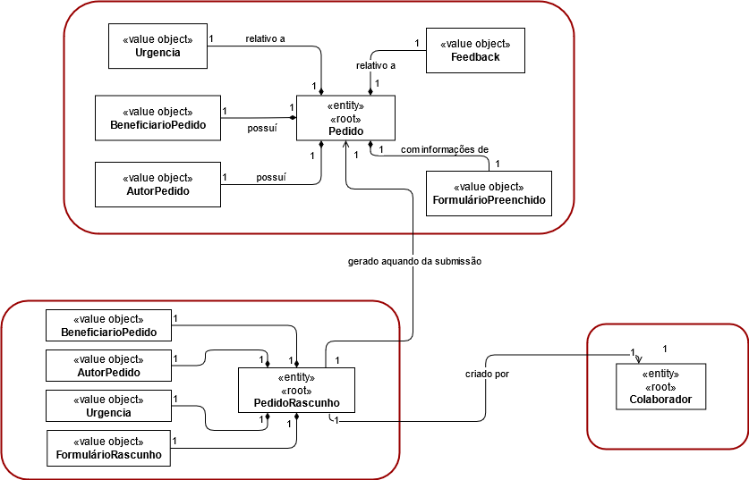
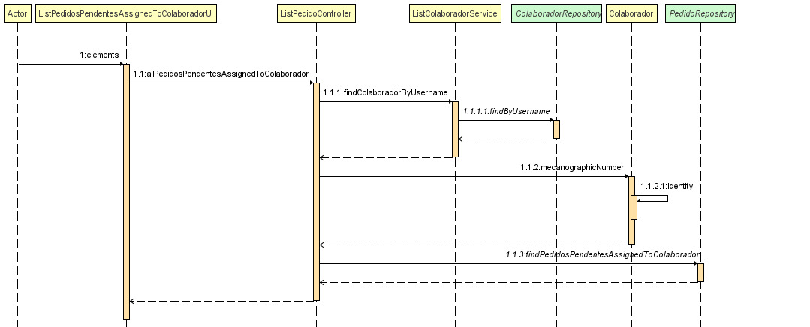
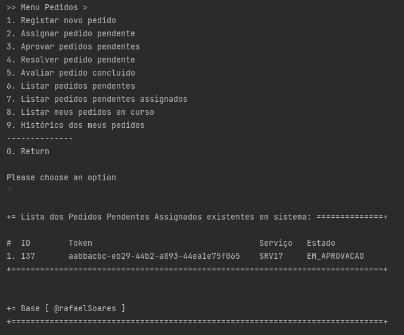

# 3021 - consultar as tarefas pendentes que me estão assignadas.
=======================================


# 1. Requisitos

- 3021 - Como utilizador, eu pretendo consultar as tarefas pendentes que me estão assignadas.

A interpretação feita deste requisito foi no sentido em que utilizador possa efetuar uma consulta das tarefas pendentes que lhe estão assignadas.;  


# 2. Análise

## 2.1 Modelo de Domínio




# 3. Design

## 3.1 Realização da Funcionalidade




## 3.2. Padrões Aplicados

| **Padrão**   | **Observações**				|
|--------------|--------------------------------|
| Service      | classes que contém lógica de negócio, mas que não pertence a nenhuma Entidade ou Objetos de Valores. |
| Repository   | classes responsáveis por administrar o ciclo de vida dos objetos. Centralizam operações de criação, alteração e remoção de objetos |


## 3.3. Testes

De forma a aferir uma correta satisfação dos requisitos da US foram concebidos os seguintes testes:

**Teste 1:** Validar listagem com tarefas que não lhe sao assignadas
**Teste 2:** Validar listagem com tarefas com diferentes estados
**Teste 3:** Validar listagem vazia
**Teste 4:** Validar listagem com tarefas somente daquele colaborador
**Teste 5:** Validar listagem com tarefas de outros colaboradores


# 4. Implementação

```
public class ListPedidosPendentesAssignedToColaboradorUI extends AbstractListUI<Pedido> {

    private ListPedidoController theController = new ListPedidoController();
    private final AuthorizationService authz = AuthzRegistry.authorizationService();
    private final Username user = authz.session().get().authenticatedUser().identity();

    @Override
    public String headline() {return "Lista dos Pedidos Pendentes Assignados existentes em sistema:";}

    @Override
    protected String emptyMessage() {return "Não existem pedidos!";}

    @Override
    protected Iterable<Pedido> elements() {return theController.allPedidosPendentesAssignedToColaborador(user);}

    @Override
    protected Visitor<Pedido> elementPrinter() {return new PedidoPrinter();}

    @Override
    protected String elementName() {return "Pedidos Pendentes Assignados";}

    @Override
    protected String listHeader() {return String.format("#  %-10s%-40s%-10s%-10s", "ID", "Token", "Serviço", "Estado");}
}
```

```
 public List<Pedido> allPedidosPendentesAssignedToColaborador(Username user) {
        Colaborador colab = listColaboradorService.findColaboradorByUsername(user).get();
        return this.pedidoRepository.findPedidosPendentesAssignedToColaborador(colab.mecanographicNumber());
    }
```


# 5. Integração/Demonstração



# 6. Observações

Nada a assinalar.
