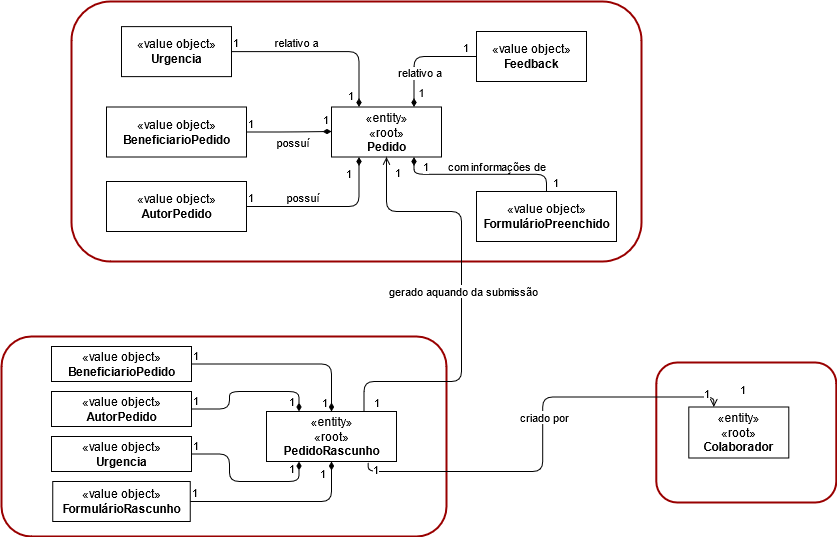
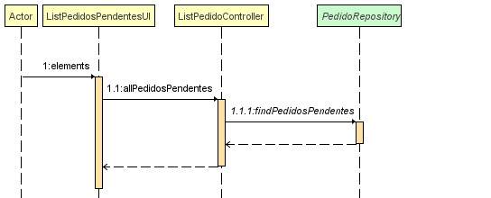
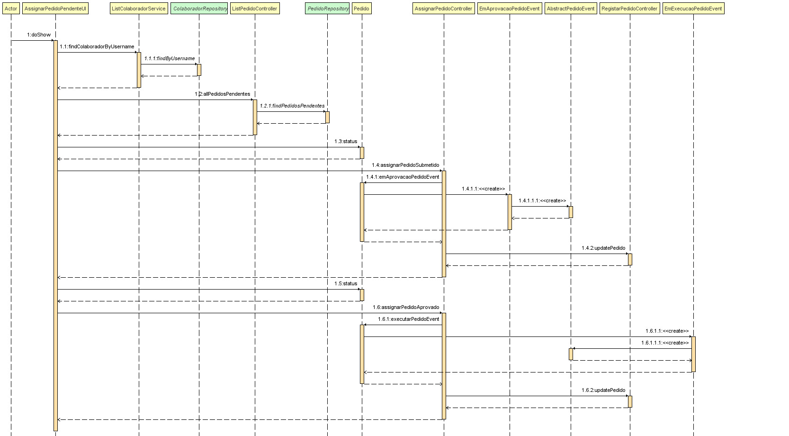
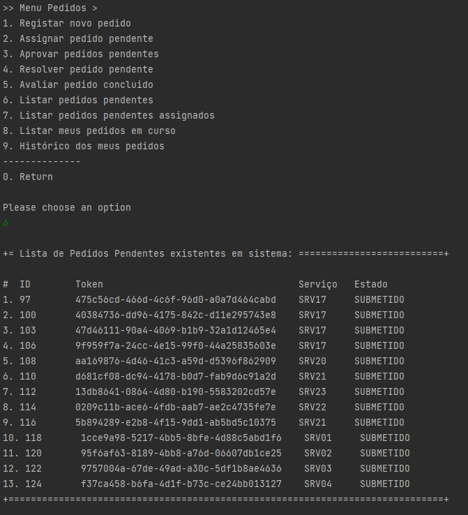
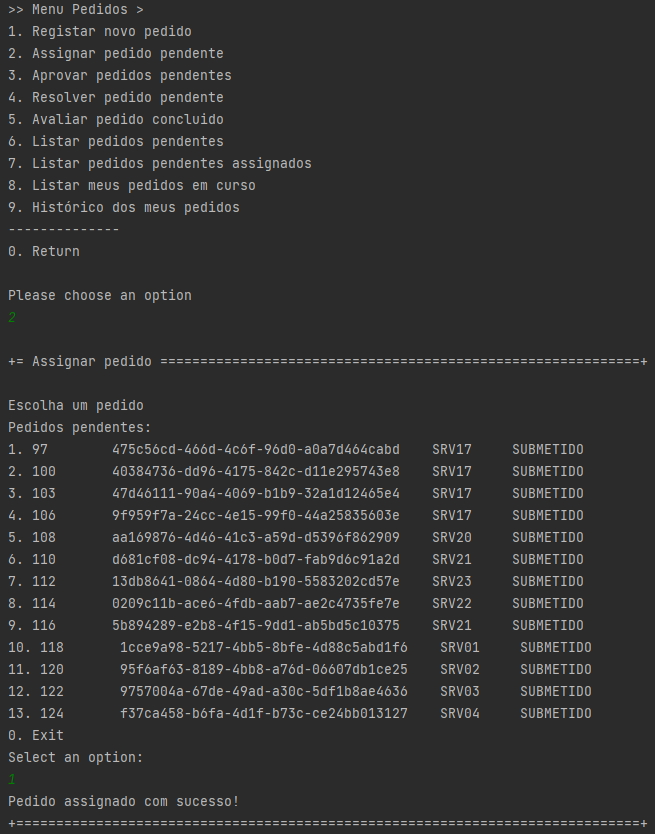

# 3022 - consultar as tarefas pendentes que eu posso reivindicar para mim e, caso o deseje, concretize essa reivindicação.
=======================================


# 1. Requisitos

- 3022 - Como utilizador, eu pretendo consultar as tarefas pendentes que eu posso reivindicar para mim e, caso o deseje, concretize essa reivindicação.

A interpretação feita deste requisito foi no sentido em que utilizador possa efetuar uma consulta das tarefas disponiveis para reinvindicar e caso pretenda, fazer a reinvindicação. 


# 2. Análise

## 2.1 Modelo de Domínio




# 3. Design

## 3.1 Realização da Funcionalidade






## 3.2. Padrões Aplicados

| **Padrão**   | **Observações**				|
|--------------|--------------------------------|
| Service      | classes que contém lógica de negócio, mas que não pertence a nenhuma Entidade ou Objetos de Valores. |
| Repository   | classes responsáveis por administrar o ciclo de vida dos objetos. Centralizam operações de criação, alteração e remoção de objetos |


## 3.3. Testes

De forma a aferir uma correta satisfação dos requisitos da US foram concebidos os seguintes testes:

**Teste 1:** Validar listagem com tarefas que não lhe possam ser assignadas
**Teste 2:** Validar listagem com tarefas com diferentes estados
**Teste 3:** Validar listagem vazia
**Teste 4:** Possibilidade de assignar tarefas nao pendentes
**Teste 5:** Possibilidade de assignar tarefas de outras equipas


# 4. Implementação

```
public class ListPedidosPendentesUI extends AbstractListUI<Pedido> {
    private ListPedidoController theController = new ListPedidoController();

    @Override
    public String headline() {return "Lista de Pedidos Pendentes existentes em sistema:";}

    @Override
    protected String emptyMessage() {return "Não existem pedidos pendentes disponiveis!";}

    @Override
    protected Iterable<Pedido> elements() {return theController.allPedidosPendentes();}

    @Override
    protected Visitor<Pedido> elementPrinter() {return new PedidoPrinter();}

    @Override
    protected String elementName() {return "Pedidos Pendentes";}

    @Override
    protected String listHeader() {return String.format("#  %-10s%-40s%-10s%-10s", "ID", "Token", "Serviço", "Estado");}
}
```

```
  public List<Pedido> allPedidosPendentes() {return this.pedidoRepository.findPedidosPendentes();}
```

```
 @Override
    protected boolean doShow() {

        Colaborador colaborador = service.findColaboradorByUsername(user).get();
        final Iterable<Pedido> pedidos = this.theController.allPedidosPendentes();

        final SelectWidget<Pedido> selectorPedidos = new SelectWidget<>("Pedidos pendentes:", pedidos,
                new PedidoPrinter());

        if (selectorPedidos.selectedOption() == 0) {return false;}

        if (!pedidos.iterator().hasNext()) {System.out.println("Não há pedidos pendentes!");
            return false;}

        System.out.println("Escolha um pedido");
        selectorPedidos.show();

        final Pedido pedido = selectorPedidos.selectedElement();

        if (pedido.status() == PedidoStatus.SUBMETIDO) {theControllerAssignar.assignarPedidoSubmetido(pedido, colaborador);
        } else if (pedido.status() == PedidoStatus.APROVADO) {theControllerAssignar.assignarPedidoAprovado(pedido, colaborador);
        } else {return false;}

        System.out.println("Pedido assignado com sucesso!");
        return true;
    } 
```


# 5. Integração/Demonstração





# 6. Observações

Nada a assinalar.
