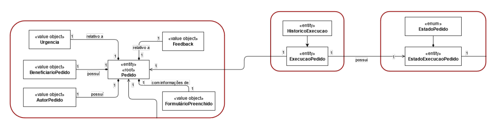

# USDemo1
=======================================

# 1. Requisitos

- US3023  (issue41) - Como utilizador, eu pretendo realizar uma tarefa que tenho como pendente.

O que nos retirados do caderno de encargo foi que a realização, pode ser opcional e prévia, de uma atividade/tarefa que visa determinar a aprovação/rejeição
do pedido com vista à sua posterior satisfação.
Ou seja uma atividade de aprovacao manual pode ser asignada ao responsavel do criador do pedido e a sua aprovacao vai avancar no estado do pedido.
O seu cancelamento implica o cancelamento do pedido.
Esta issue tem algumas dependencias, pois so conseguimos aprovar pedidos apos a atribuicao destes isues esteja concluida.

## 1.1 Regras de Negócio

* Um Pedido dispoe de uma atividade manual de aprovacao.
* So posso aprovar pedidos que estao assignados a mim.
* A assignação dos pedidos de aprovacao implica que eu sou supervisor do beneficiario do pedido
* Os Pedidos so podem ser aprovados se estiverem em estado assignado
* Os Pedidos so podem ser reprovados se estiverem em estado assignado
* Os Pedidos ao serem aprovados vão para o estado aprovado
* Os Pedidos ao serem recusados vão para o estado recusado

# 2. Análise

# 2.1 Definição

Aprovação serviços

# 2.2 Conceito

## 2.3 Modelo de Domínio

# 3. Design

## 3.1. Realização da Funcionalidade

*Inserir o modelo de dominio*

## 3.2. Diagrama de Classes

## 3.3. Padrões Aplicados

|--------------|----------------------------------------------------|
|  **Padrão**  | **Observações**		                    |
|--------------|----------------------------------------------------|
| Factory      | Padrão utilizado para atribuir a responsabilidade  |
|              | de criar objetos a uma classe particular. 	    |
| Repository   | Padrão utilizado para persistir os objetos criados.|
| MVC          | Padrão utilizado para a UI e Controllers. 	    |
|--------------|----------------------------------------------------|

## 3.4. Testes 

**Teste 1:** * Verificar

**Teste 2:** * Os colaboradores da lista de responsaveis tem de conseguir alterar os dados de um catalogo

**Teste 3:** * Após associação de uma equipa a lista de criterios, a lista de criterios deve conter essa equipa

**Teste 4:** * Os colaboradores que pertencem as equipas que estao na lista de criterios tem que conseguir ver este catalogo e conseguir solicitar os servicos contidos nele

# 4. Implementação

*Nesta secção a equipa deve providenciar, se necessário, algumas evidências de que a implementação está em conformidade com o design efetuado. Para além disso, deve mencionar/descrever a existência de outros ficheiros (e.g. de configuração) relevantes e destacar commits relevantes;*

*Recomenda-se que organize este conteúdo por subsecções.*

# 5. Integração/Demonstração

*Nesta secção a equipa deve descrever os esforços realizados no sentido de integrar a funcionalidade desenvolvida com as restantes funcionalidades do sistema.*

# 6. Observações

*Nesta secção sugere-se que a equipa apresente uma perspetiva critica sobre o trabalho desenvolvido apontando, por exemplo, outras alternativas e ou trabalhos futuros relacionados.*