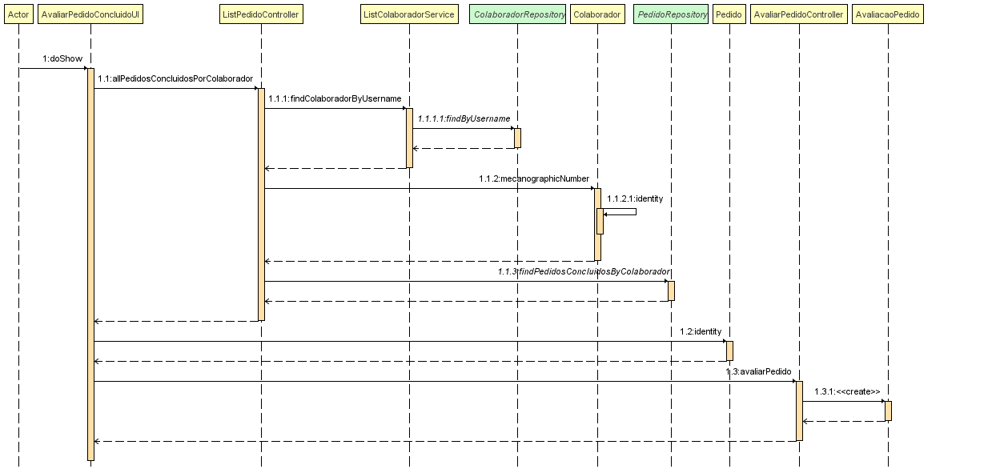
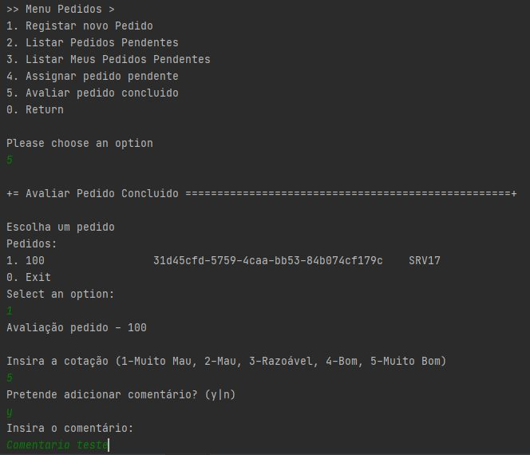

# 3051 - transmitir o meu grau de satisfação
=======================================


# 1. Requisitos

- 3051 - Como utilizador, eu pretendo transmitir o meu grau de satisfação sobre a resolução de um dado pedido por mim efetuado.

A interpretação feita deste requisito foi no sentido de que um utilizador possa dar feedback sobre o seu grau de satisfação relativamente à satisfação ou não do seu pedido que é dado como finalizado.


# 3. Design

## 3.1 Realização da Funcionalidade



## 3.2. Padrões Aplicados

| **Padrão**	   | **Observações**			|
|--------------|--------------------------------|
| Service      | classes que contém lógica de negócio, mas que não pertence a nenhuma Entidade ou Objetos de Valores. |
| Repository      | classes responsáveis por administrar o ciclo de vida dos objetos. Centralizam operações de criação, alteração e remoção de objetos |


## 3.3. Testes

De forma a aferir uma correta satisfação dos requisitos da US foram concebidos os seguintes testes:

**Teste 1:** testar a adição de um feedback a um pedido não concluído
**Teste 2:** Cotar com valor diferentes da numeração sugerida [1-5]
**Teste 3:** Adicionar comentário vazio


# 4. Implementação

- transmitir o meu grau de satisfação
```
System.out.println("Escolha um pedido");
selectorPedidos.show();

final Pedido pedido = selectorPedidos.selectedElement();

System.out.println("Avaliação pedido - " + pedido.identity() + "\n");

String cotacao = Console.readLine("Insira a cotação (1-Muito Mau, 2-Mau, 3-Razoável, 4-Bom, 5-Muito Bom)");
while (!(cotacao.equals("1") || cotacao.equals("2")
				|| cotacao.equals("3") || cotacao.equals("4")
				|| cotacao.equals("5"))) {
		System.out.println("Seleção errada! Insira novamente");
		cotacao = Console.readLine("Insira a cotação (1-Muito Mau, 2-Mau, 3-Razoável, 4-Bom, 5-Muito Bom)");
}

String opcao = Console.readLine("Pretende adicionar comentário? (y|n)");
while (!(opcao.equals("y") || opcao.equals("n"))) {
		System.out.println("Seleção errada! Insira novamente");
		opcao = Console.readLine("Pretende adicionar comentário? (y|n)");
}
String comentario = null;

if (opcao.equals("y")) {
		comentario = Console.readLine("Insira o comentário:");
}

theController.avaliarPedido(pedido, Integer.parseInt(cotacao), comentario);

return false;


```


# 5. Integração/Demonstração



# 6. Observações

Nada a assinalar.
