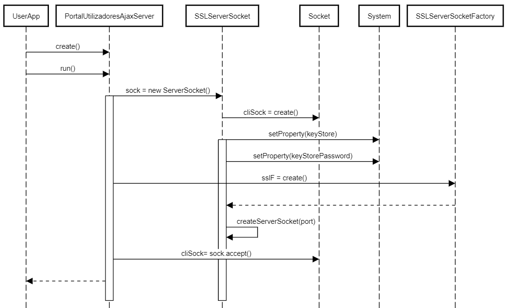
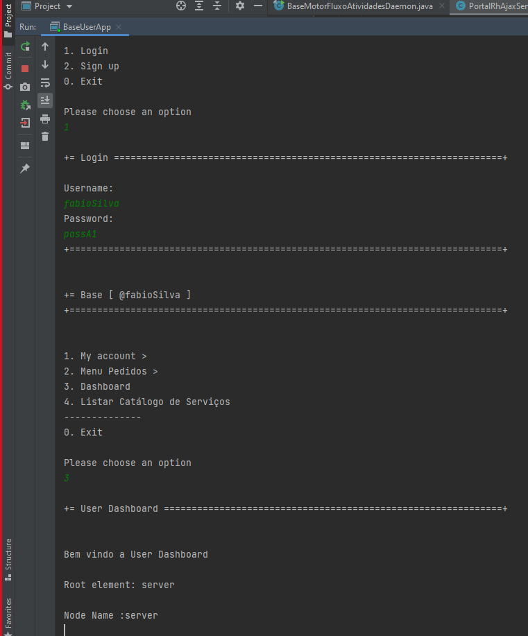
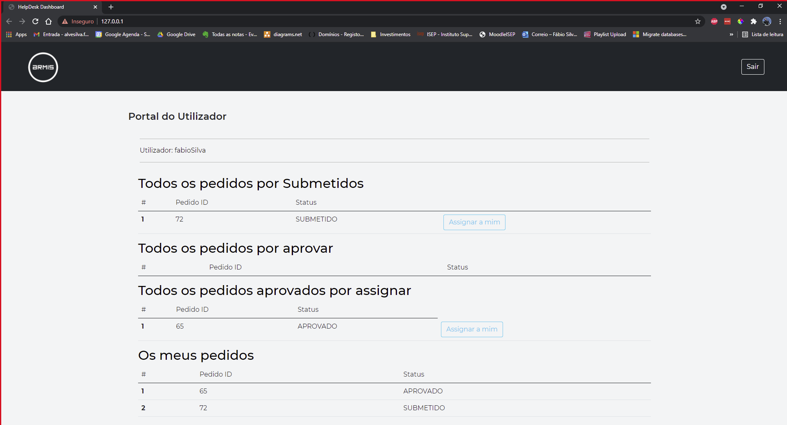
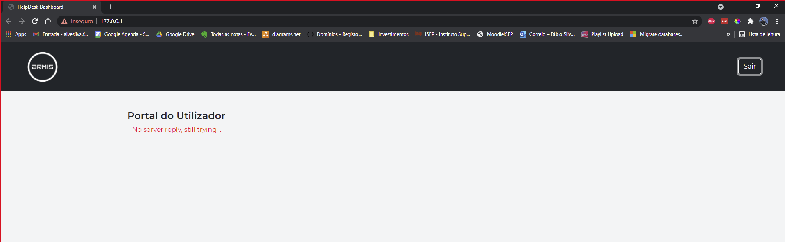

# 3101 - Como Gestor de Projeto, eu pretendo que as comunicações realizadas através do protocolo SDP2021 estejam protegidas.
=======================================

# 1. Requisitos

*US3101* - Como gestor de projecto, eu pretendo que as comunicações realizadas através do protocolo SDP2021 estejam protegidas.
A interpretação feita deste caso de uso, foi no sentido de proteger as ligações client-server entre aplicação portal dos utilizadores e o motor de fluxo de atividades. Para isso teremos de aplicar SSL/TLS com autenticação mútua baseada em certificados de chave pública. Esta adição ao projeto, em nada deve alterar o funcionamento normal do programa, apenas deve proteger a ligação efetuada através de um socket quando as duas partes estabelecem comunicação.

# 2. Análise

Para a resolução desta funcionalidade, a mensagem será protegida nas comunicações HTTPS. HTTPS é uma implementação do protocolo HTTP sobre uma camada adicional de segurança que utiliza o protocolo SSL/TLS. Essa camada adicional permite que os dados sejam transmitidos por meio de uma conexão criptografada e que se verifique a autenticidade do servidor e do cliente por meio de certificados digitais.
Na cadeia de eventos, que leva à comunicação entre BaseUserApp e MotorFluxoAtividades, já implementada no Sprint anterior, devem ser feitas alterações, para que o socket usado, seja protegido através de TLS/SSL. Para isso será necessário uma Java KeyStore (JKS) em comum, que é essencialmente um repositório de certificados de segurança. Neste sentido, daremos uso a bibliotecas específicas associadas a este protocolo. Começaremos por adicionar às propriedades do sistema os certificados necessários a que o servidor pode confiar por parte dos clientes autorizados e adicionar também os certificados e palavra-chave ao próprio servidor.
Será usada a classe nativa SSLServerSocketFactory e será obtida a Server Factory standard. Vai ser criada um socket de comunicação onde será dito que qualquer client-side que tente a comunicação, necessitará de autenticação.

# 3. Design

Ao inicializar o servidor HTTPS do portal de utilizador no Motor de Fluxo de Atividades, que implementa um Runnable, é lido um ficheiro de configuração onde estão definidos a porta para utilização, é criado um ServerSocket seguro e posteriormente fica em modo de escuta à espera de pedidos dos clientes. Esses pedidos são efetuados através do browser na porta e no ip respectivos. O utilizador pode fazer pedidos à base de dados através da interface gráfica onde essas interações irão invocar métodos contidos num ficheiro AJAX. O ficheiro AJAX faz requests do tipo PUT e GET ao servidor que está à escuta e onde fazemos a diferenciação dos tipos de requests e o devido tratamento.

## 3.1 Realização da Funcionalidade




# 4. Implementação

```	
	private static Username username;
    private static SSLServerSocket sock;
	
    public PortalUtilizadoresAjaxServer(Username user) {

        PortalUtilizadoresAjaxServer.username = user;
    }

    @Override
    public void run() {
        SSLSocket cliSock;

        System.setProperty("javax.net.ssl.keyStore", "base.server.motorfluxoatividades/src/main/java/base/server/motorfluxoatividades/dashboard/portalusers/server.jks");
        System.setProperty("javax.net.ssl.keyStorePassword", "forgotten");

        try {
            HttpServerConfigurationManager.getInstance().loadConfigurationFile(
                    "base.server.motorfluxoatividades/src/main/resources/configuracao_portal_utilizadores.xml");
            HttpServerConfiguration conf = HttpServerConfigurationManager.getInstance().getCurrentConfiguration();

            SSLServerSocketFactory sslF = (SSLServerSocketFactory) SSLServerSocketFactory.getDefault();
            sock = (SSLServerSocket) sslF.createServerSocket(conf.getPort());

            boolean keepAlive = true;
            while (keepAlive) {
                try {
                    cliSock = (SSLSocket) sock.accept();
                    PortalUtilizadoresAjaxRequest req = new PortalUtilizadoresAjaxRequest(cliSock, conf.getWebroot());
                    synchronized (req) {
                        req.start();
                        //synchronized wait block
                        req.wait();
                        //synchronized notify block
                        keepAlive = req.keepAline;
                    }
                } catch (IOException e) {
                    e.printStackTrace();
                } catch (InterruptedException e) {

                }
            }
            closeConnetion();
        } catch (IOException ex) {
            ex.printStackTrace();
            System.out.println("Server failed to open local port ");
            System.exit(1);
        }
	}
```

# 5. Integração/Demonstração

## 5.1 Demonstração na Consola



## 5.2 Demonstração da Dashboard



## 5.3 Demonstração Mensagem Server No Reply



# 6. Observações

Nada a assinalar.
