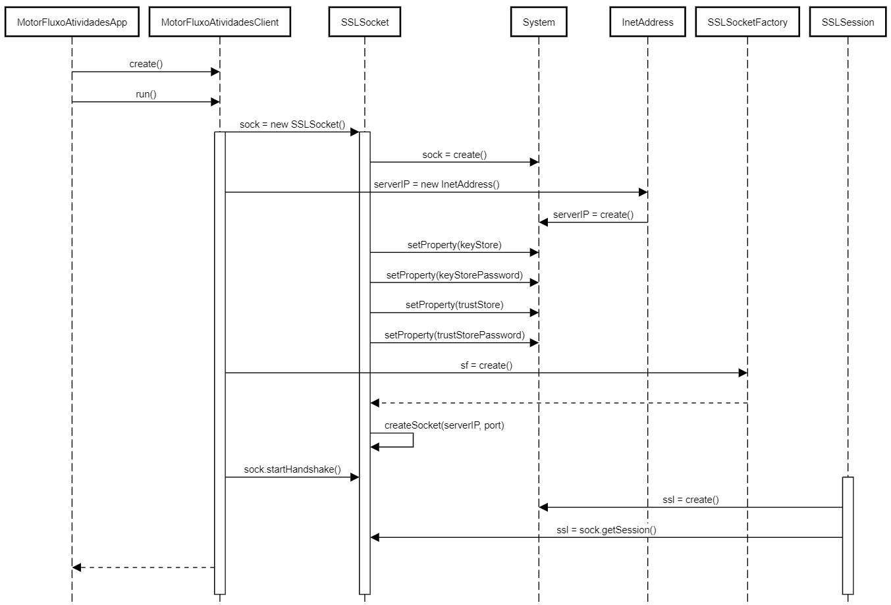
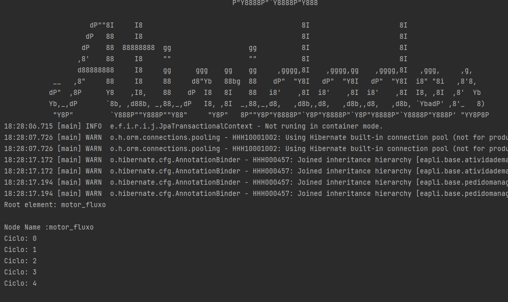

# 4051 - Como Gestor de Projeto, eu pretendo que as comunicações realizadas através do protocolo SDP2021 estejam protegidas.
=======================================

# 1. Requisitos

*US4051* - Como gestor de projecto, eu pretendo que as comunicações realizadas através do protocolo SDP2021 estejam protegidas.
A interpretação feita deste caso de uso, foi no sentido de proteger as ligações client-server entre o Motor de Fluxo de Atividades e o Executor de Tarefas Automaticas. Para isso teremos de aplicar SSL/TLS com autenticação mútua baseada em certificados de chave pública. Esta adição ao projeto, em nada deve alterar o funcionamento normal do programa, apenas deve proteger a ligação efetuada através de um socket quando as duas partes estabelecem comunicação.

# 2. Análise

Para a resolução desta funcionalidade, a mensagem será protegida nas comunicações TCP.
Na cadeia de eventos, que leva à comunicação entre MotorFluxoAtividades e ExecutorTarefasAutomaticas, já implementada no Sprint anterior, devem ser feitas alterações, para que o socket usado, seja protegido através de TLS/SSL. Para isso será necessário uma Java KeyStore (JKS) em comum, que é essencialmente um repositório de certificados de segurança. Neste sentido, daremos uso a bibliotecas específicas associadas a este protocolo. Começaremos por adicionar às propriedades do sistema os certificados necessários a que o servidor pode confiar por parte dos clientes autorizados e adicionar também os certificados e palavra-chave ao próprio servidor.
Será usada a classe nativa SSLServerSocketFactory e será obtida a Server Factory standard. Vai ser criada um socket de comunicação onde será dito que qualquer client-side que tente a comunicação, necessitará de autenticação.

# 3. Design

Ao inicializar o servidor TCP do Executor de Tarefas Automaticas, irá ser disponibilizado um servidor TCP capaz de receber mensagens seguras. 
Após o serviço disponibilizado pelo Executor de Tarefas Automaticas, é possivel executar o Motor de Fluxo de Atividades que lê um ficheiro de configuração onde estão definidos a porta e o ip, é criado um SSLSocket.

## 3.1 Realização da Funcionalidade




# 4. Implementação

```
public class MotorFluxoAtividadesClient {

    static InetAddress serverIP;
    static SSLSocket sock;

    static final String KEYSTORE_PASS = "forgotten";
    static final int SERVER_PORT = 32507;

    public Pedido pedido;
    public int type;

    public MotorFluxoAtividadesClient(Pedido pedido, int type) {
        this.pedido = pedido;
        this.type = type;
    }

    public void run() {
        // Trust these certificates provided by servers
        System.setProperty("javax.net.ssl.trustStore", "base.app.user.console/src/main/java/eapli/base/app/user/console/HttpClient/server_J.jks");
        System.setProperty("javax.net.ssl.trustStorePassword", KEYSTORE_PASS);

        // Use this certificate and private key for client certificate when requested by the server
        System.setProperty("javax.net.ssl.keyStore", "base.app.user.console/src/main/java/eapli/base/app/user/console/HttpClient/client1_J.jks");
        System.setProperty("javax.net.ssl.keyStorePassword", KEYSTORE_PASS);

        SSLSocketFactory sf = (SSLSocketFactory) SSLSocketFactory.getDefault();

        try {
            serverIP = InetAddress.getByName("127.0.0.1");
        } catch (UnknownHostException ex) {
            System.out.println("Invalid server: 127.0.0.1");
            System.exit(1);
        }

        System.out.println("Estabelecendo conexão...");
        try {
            sock = (SSLSocket) sf.createSocket(serverIP, SERVER_PORT);
        } catch (IOException ex) {
            System.out.println("Failed to connect. ");
            ex.printStackTrace();
            System.exit(1);
        }

        try {
            sock.startHandshake();
            SSLSession ssl = sock.getSession();

            System.out.println("------------------------------------------------------");
            System.out.println("Conectado ao servidor");
            System.out.println("------------------------------------------------------");
            System.out.println("Versao SSL/TLS: " + ssl.getProtocol() + "\nCypher suite: " + ssl.getCipherSuite());
            System.out.println("------------------------------------------------------");


            ObjectOutputStream sOut = new ObjectOutputStream(sock.getOutputStream());
            ObjectInputStream sIn = new ObjectInputStream(sock.getInputStream());

            Message msgPedido = new Message(1, type, pedido.identity().toString().length(), pedido.identity().toString());
            sOut.writeObject(msgPedido);
            sOut.flush(); //libertar buffer para envio

            System.out.println("\n------------------------------------------------------");
            System.out.println("Mensagem enviada:");
            System.out.println(msgPedido.toString());
            System.out.println("------------------------------------------------------");

            Message respostaPedido = (Message) sIn.readObject();
            System.out.println("\n------------------------------------------------------");
            System.out.println("Mensagem recebida:");
            System.out.println(respostaPedido.toString());
            System.out.println("------------------------------------------------------");

            Message msgTerminar = new Message(1, 1, 0, "");
            sOut.writeObject(msgTerminar);
            sOut.flush(); //libertar buffer para envio

            System.out.println("\n------------------------------------------------------");
            System.out.println("Mensagem para terminar enviada:");
            System.out.println(msgTerminar.toString());
            System.out.println("------------------------------------------------------");

            Message respostaTerminar = (Message) sIn.readObject();
            System.out.println("\n------------------------------------------------------");
            System.out.println("Resposta ao comando terminar recebida:");
            System.out.println(respostaTerminar.toString());
            System.out.println("------------------------------------------------------");

            System.out.println("\n------------------------------------------------------");
            System.out.println("Conexão do servidor terminada.");
            System.out.println("------------------------------------------------------");

            sIn.close();
            sOut.close();
            sock.close();
        } catch (IOException | ClassNotFoundException e) {
            e.printStackTrace();
        }
    }
}
```

# 5. Integração/Demonstração

## 5.1 Demonstração na Consola



# 6. Observações

Nada a assinalar.
