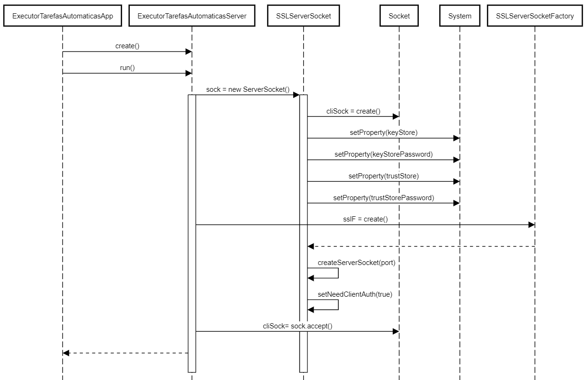
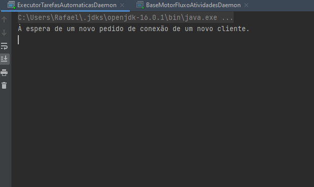

# 5002 - Como Gestor de Projeto, eu pretendo que as comunicações realizadas através do protocolo SDP2021 estejam protegidas.
=======================================

# 1. Requisitos

*US5002* - Como gestor de project, eu pretendo que as comunicações realizadas através do protocolo SDP2021 estejam protegidas.
A interpretação feita deste caso de uso, foi no sentido de proteger as ligações client-server entre executor de tarefas automaticas e o motor de fluxo de atividades. Para isso teremos de aplicar SSL/TLS com autenticação mútua baseada em certificados de chave pública. Esta adição ao projeto, em nada deve alterar o funcionamento normal do programa, apenas deve proteger a ligação efetuada através de um socket quando as duas partes estabelecem comunicação.

# 2. Análise

Para a resolução desta funcionalidade, a proteção será protegida nas comunicações TCP.
Na cadeia de eventos, que leva à comunicação entre ExecutorTarefasAutomaticas e MotorFluxoAtividades, já implementada no Sprint anterior, devem ser feitas alterações, para que o socket usado, seja protegido através de TLS/SSL. Para isso será necessário uma Java KeyStore (JKS) em comum, que é essencialmente um repositório de certificados de segurança. Neste sentido, daremos uso a bibliotecas específicas associadas a este protocolo. Começaremos por adicionar às propriedades do sistema os certificados necessários a que o servidor pode confiar por parte dos clientes autorizados e adicionar também os certificados e palavra-chave ao próprio servidor.
Será usada a classe nativa SSLServerSocketFactory e será obtida a Server Factory standard. Vai ser criada um socket de comunicação onde será dito que qualquer client-side que tente a comunicação, necessitará de autenticação.

# 3. Design

Ao inicializar o servidor TCP do Executor de Tarefas Automaticas no Motor de Fluxo de Atividades, que implementa um Runnable, é lido um ficheiro de configuração onde estão definidos a porta para utilização, é criado um ServerSocket seguro e posteriormente fica em modo de escuta à espera de pedidos automaticos dos clientes. Esses pedidos são efetuados através do Motor de Fluxo de Atividades.

## 3.1 Realização da Funcionalidade




# 4. Implementação

```
	public class Server {

    private SSLServerSocket serverSocket;

    static final String TRUSTED_STORE = "base.server.executortarefasautomaticas/src/main/java/base/server/executortarefasautomaticas/presentation/server_J.jks";
    static final String KEYSTORE_PASS = "forgotten";

    private static HashMap<Socket, DataOutputStream> clientList = new HashMap<>();

    public static synchronized void addClient(Socket s) throws Exception {
        clientList.put(s, new DataOutputStream(s.getOutputStream()));
    }

    public static synchronized void removeClient(Socket s) throws Exception {
        //clientList.get(s).write(0);
        clientList.remove(s);
    }

    private static void fechaSocket(Socket s) throws IOException {
        s.close();
    }

    public void criarServerSocket(int porta) throws IOException {

        // Trust these certificates provided by authorized clients
        System.setProperty("javax.net.ssl.trustStore", TRUSTED_STORE);
        System.setProperty("javax.net.ssl.trustStorePassword", KEYSTORE_PASS);

        // Use this certificate and private key as server certificate
        System.setProperty("javax.net.ssl.keyStore", TRUSTED_STORE);
        System.setProperty("javax.net.ssl.keyStorePassword", KEYSTORE_PASS);

        SSLServerSocketFactory sslF = (SSLServerSocketFactory) SSLServerSocketFactory.getDefault();

        try {
            this.serverSocket = (SSLServerSocket) sslF.createServerSocket(porta);
            this.serverSocket.setNeedClientAuth(true);

        } catch (IOException ex) {
            System.out.println("Porta não disponível.");
            System.exit(1);
        }
    }

    public Socket esperaConexao() throws IOException {
        Socket socket = serverSocket.accept();
        return socket;
    }

    public static void trataConexao(Socket socket) throws IOException {

        //protocolo da aplicação
        try {
            // Criar streams de entrada e saida
            ObjectOutputStream output = new ObjectOutputStream(socket.getOutputStream());
            ObjectInputStream input = new ObjectInputStream(socket.getInputStream());

            System.out.println("A tratar mensagem...");

            Message recebida = null;
            do {
                //Ler objecto Mensagem
                recebida = (Message) input.readObject();
                System.out.println("Mensagem recebida: ");
                System.out.println(recebida.toString());

                ExecutarPedidoProtocolRequest eppr =
                        ExecutarPedidoProtocolMessageParser.parse(recebida.versao() + "," + recebida.codigo() + ","
                                                                    + recebida.numeroBytes() + "," + recebida.dados());
                String response = eppr.execute();

                Message resposta = new Message(
                        Integer.parseInt(response.split(",")[0]),
                        Integer.parseInt(response.split(",")[1]),
                        Integer.parseInt(response.split(",")[2]),
                        response.split(",")[3]);

                output.writeObject(resposta);
                output.flush();
            } while (recebida.codigo() != 1);

            // close comunications
            input.close();
            output.close();
        } catch (IOException | ClassNotFoundException e) {
            System.out.println(e);
        } finally {
            fechaSocket(socket);
        }
    }
}
```

# 5. Integração/Demonstração

## 5.1 Demonstração na Consola




# 6. Observações

Nada a assinalar.
