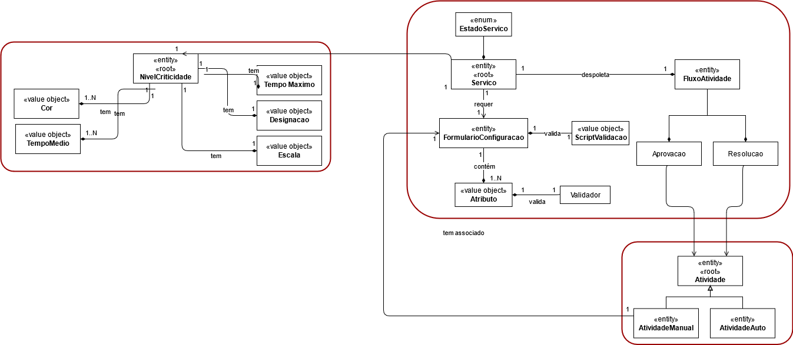
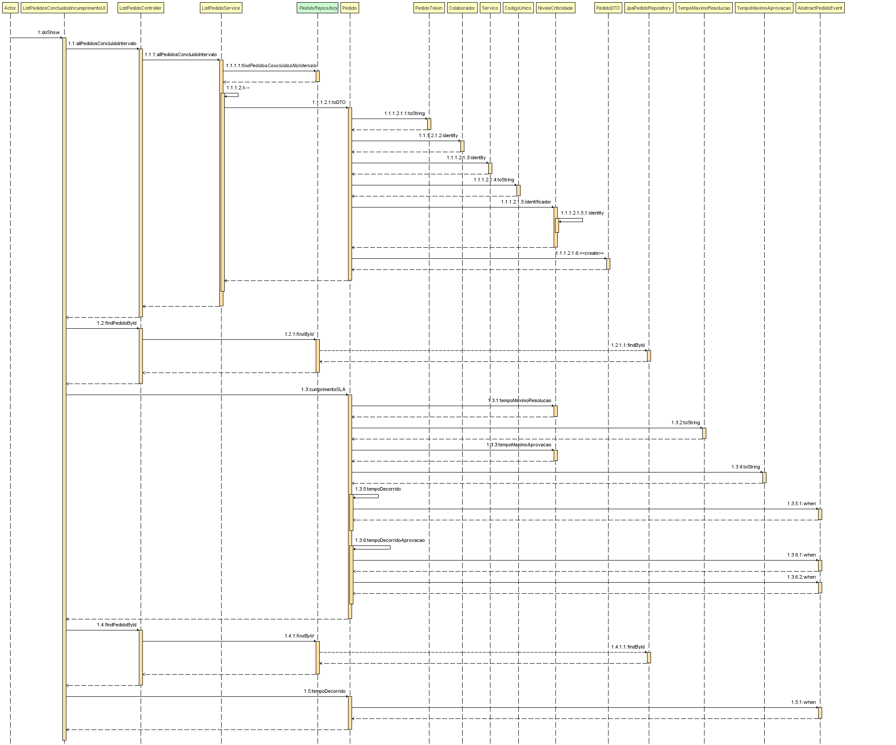
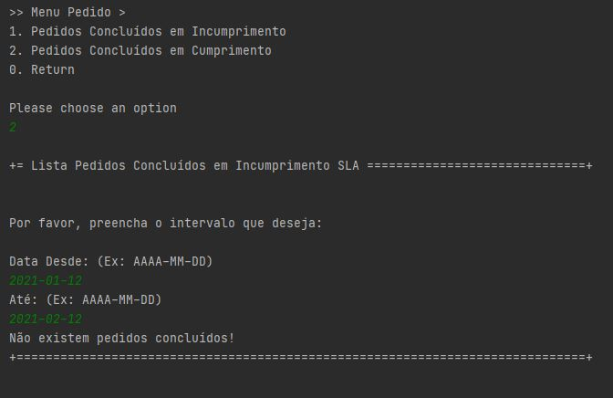

# US 2013 Incumprimento de SLA
=======================================


# 1. Requisitos

- 2013 - Como gestor de Help Desk, eu pretendo obter uma listagem sobre o (in)cumprimento do SLA das solicitações recebidas e já concluídas num determinado intervalo de tempo.


A interpretação feita deste requisito foi no sentido de que um gestor de help desk possa ter a capacidade de identificar, para cada serviço solicitado, a sua conformidade e contribuição positiva ou negativa relativamente ao SLA.
Para tal, é tido em consideração os tempos médios de aprovação e tempos médios de resolução.
Para efeitos de cumprimentos dos níveis de criticidade, considera-se o incumprimento quando um ou ambos os tempos sejam ultrapassados. Caso contrário, se o tempo decorrido para a validação e execução forem inferiores ou iguais ou valores médios estabelecidos, considera-se que o SLA foi cumprido.   

# 2. Análise

## 2.1. Modelo de domínio




# 3. Design

## 3.1. Realização da Funcionalidade




## 3.2. Padrões Aplicados

| **Padrão**	   | **Observações**			|
|--------------|--------------------------------|
| Service      | classes que contém lógica de negócio, mas que não pertence a nenhuma Entidade ou Objetos de Valores. |
| Repository    | classes responsáveis por administrar o ciclo de vida dos objetos. Centralizam operações de criação, alteração e remoção de objetos |
| DTO | padrão utilizado para transferir dados entre subsistemas |


## 3.4. Testes

De forma a aferir uma correta satisfação dos requisitos da US foram concebidos os seguintes testes:


**Teste 1:** Validação de tempo a nulo
**Teste 2:** Validação de pedidos sem tempo registado
**Teste 3:** Pedidos sem níveis de criticidade
**Teste 4:** testes aos intervalos de tempo


# 4. Implementação

```
System.out.println("\nPor favor, preencha o intervalo que deseja:\n");

        final String dataFrom = Console.readLine("Data Desde: (Ex: AAAA-MM-DD)");
        final String dataTo = Console.readLine("Até: (Ex: AAAA-MM-DD)");

        List<PedidoDTO> listaPedidos = pedidoController.allPedidosConcluidoIntervalo(dataFrom, dataTo);
        List<PedidoDTO> listaPedidosIncumprimento = new ArrayList<>();

        if(listaPedidos.isEmpty()){
            System.out.println("Não existem pedidos concluídos!");
            return false;
        }

        for(PedidoDTO p : listaPedidos){
            Pedido pedido = pedidoController.findPedidoById(p.pk).get();
            if(!pedido.cumprimentoSLA()){
                listaPedidosIncumprimento.add(p);
            }
        }

        if(listaPedidosIncumprimento.isEmpty()){
            System.out.println("Parabéns! Não existem pedidos concluídos em incumprimento do SLA!");
            return false;
        }

        System.out.format("#  %-20s%-40s%-40s", "Identificador", "Status", "Tempo Decorrido");

        for(PedidoDTO p : listaPedidosIncumprimento){
            Pedido pedido = pedidoController.findPedidoById(p.pk).get();
            System.out.format("#  %-20s%-40s%-40s", p.pk, p.status, pedido.tempoDecorrido());
        }
        return false;
    }
```
# 5. Integração/Demonstração




# 6. Observações

Nada a assinalar.
