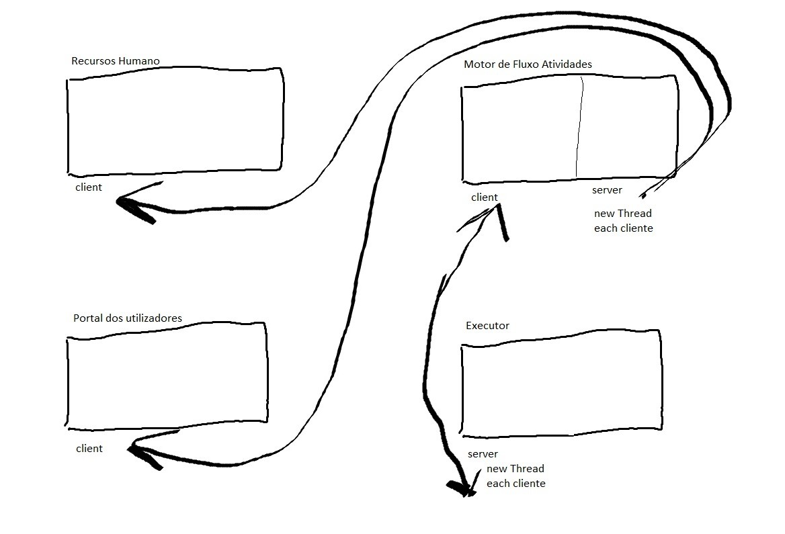

# Projeto Integrador da LEI-ISEP 2020-21 - 4º Semestre

# 1. Constituição do Grupo de Trabalho

O grupo de trabalho é constituído pelo estudantes identificados na tabela seguinte.

| **Aluno Nr.**	   | **Nome do Aluno**			|
|--------------|--------------------------------|
| 1181895  	   | Fábio Silva                	|
| 1181892      | Sarah Silva			        |
| 1181882      | Rafael Soares			        |
| 1171602      | Rui Marinho (Scrum Master)		|
| 1140858      | Carlos Moutinho		        |

# 2. Decisões técnicas e coordenação #

Nesta secção, serão mencionadas todas as decisões técnicas durante a reunião de planeamento. 
Principalmente todas as decisões técnicas que terão impacto nas tarefas dos elementos da equipa.

## Base de Dados ##

A base de dados a utilizar é o **H2**.

## Ambiente de Desenvolvimento ##

O IDE a utilizar para o desenvolvimento do projeto **INTELLiJ IDEA 2020.3.3**.

## Framework do Projeto ##

A equipa decidiu para este desenvolvimento a utilização da framework **Eapli Base**.

# 3. Calendário de Sprints #

| **Sprint** | **Início** | **Fim** |
|-----|-----------|-----------|
| A | 08/03/21 | 18/04/21 |
| B | 19/04/21 | 09/05/21 |
| C | 10/05/21 | 30/05/21 |
| D | 31/05/21 | 20/06/21 |

# 4. Distribuição de Funcionalidades #

A distribuição de requisitos/funcionalidades ao longo do período de desenvolvimento do projeto pelos elementos do grupo de trabalho realizou-se conforme descrito na tabela seguinte.

| **Aluno Nr.**	| **Sprint** | **Funcionalidade** |
|------------|----------|----------|
| 1181892 |  |  |
|  | **B**  |  us3001_issue9_PesquisarCatalogosDeServicos |
|  | **B**  |  us9001_issue10_Apresentacao |
|  | **C**  |  us2105_issue31_Bootstrap com níveis de criticidade e atribuição a catálogos |
|  | **C**  |  us5001_issue27_desenvolvido o Executor de Tarefas Automáticas |
|  | **C**  |  us1004_issue17_Desenvolvimento de uma linguagem/gramatica de suporte geral ao sistema |
|  | **D**  |  us5002_issue49_comunicações realizadas através do protocolo SDP2021 estejam protegidas |
|  | **D**  |  us4072_issue48_desenvolvido e integrado no Motor de Fluxos de Atividades algoritmos que assignem automáticamente tarefas |
|  | **D**  |  us4003_issue44_conclua o desenvolvimento do motor de fluxos de atividades tornando-o bastante robusto |
|  | **D**  |  us1007_issue39_executar/interpretar os scripts especificados na linguagem/gramática |
|  | **D**  |  us3051_issue54_transmitir o meu grau de satisfação sobre a resolução de um dado pedido por mim efetuado |
|  | **D**  |  us9002_issue51_apresentação final |
|------------|----------|----------|
| 1181882 |||
|  | **B**  |  us2053_issue08_AssociarRemoverColaboradorEquipa |
|  | **B**  |  us2051_issue06_RegistarUmColaborador |
|  | **C**  |  us3021_issue23_consultar as tarefas pendentes assignadas |
|  | **C**  |  us1006_issue19_componente representativa de uma tarefa automática |
|  | **C**  |  us3022_issue24_consultar as tarefas pendentes por reivindicar|
|  | **C**  |  us1004_issue17_Desenvolvimento de uma linguagem/gramatica de suporte geral ao sistema |
|  | **D**  |  us3101_issue43_comunicações realizadas através do protocolo SDP2021 estejam protegidas |
|  | **D**  |  us4071_issue47_desenvolvido e integrado no Motor de Fluxos de Atividades algoritmos que distribuam a realização de tarefas automáticas |
|  | **D**  |  us1007_issue39_executar/interpretar os scripts especificados na linguagem/gramática |
|  | **D**  |  us3031_issue42_consultar os meus pedidos (em curso ou o histórico) e respetivos detalhes/estado |
|  | **D**  |  us9002_issue51_apresentação final |
|------------|----------|----------|
| 1181895 |||
|  | **B**  |  us2052_issue07_RegistarEquipa |
|  | **B**  |  us2054_issue14_RegistarTipoEquipa |
|  | **C**  |  us2011_issue29_estado atual do motor de fluxos de atividades |
|  | **C**  |  us3011_issue22_dashboard web |
|  | **C**  |  us4002_issue26_Motor de Fluxo de Atividades disponibilize os dados necessários às aplicações |
|  | **C**  |  us1004_issue17_Desenvolvimento de uma linguagem/gramatica de suporte geral ao sistema |
|  | **D**  |  us4051_issue45_comunicações realizadas através do protocolo SDP2021 estejam protegidas |
|  | **D**  |  us4072_issue48_desenvolvido e integrado no Motor de Fluxos de Atividades algoritmos que assignem automáticamente tarefas |
|  | **D**  |  us1007_issue39_executar/interpretar os scripts especificados na linguagem/gramática |
|  | **D**  |  us3003_issue40_solicitar um serviço do catálogo de serviços que me é disponibilizado |
|  | **D**  |  us9002_issue51_apresentação final |
|------------|----------|----------|
| 1171602 |||
|  | **B**  |  us2002_issue05_CriarServico |
|  | **B**  |  us2103_issue12_BootstrapOrganizacaoEquipa |
|  | **B**  |  us1003_issue03_ConfiguraçãoEstrutura |
|  | **C**  |  us2003_issue20_continuar e completar a especificação em curso de um serviço |
|  | **C**  |  us3002_issue21_serviço do catálogo de serviços disponibilizados |
|  | **C**  |  us2104_issue28_Bootstrap com alguma informação relativa a serviços completos |
|  | **C**  |  us1004_issue17_Desenvolvimento de uma linguagem/gramatica de suporte geral ao sistema |
|  | **D**  |  us4052_issue46_comunicações realizadas através do protocolo SDP2021 estejam protegidas |
|  | **D**  |  us4071_issue47_desenvolvido e integrado no Motor de Fluxos de Atividades algoritmos que distribuam a realização de tarefas automáticas |
|  | **D**  |  us5003_issue50_conclua o desenvolvimento do Executor de Tarefas Automáticas tornando-o bastante robusto |
|  | **D**  |  us1007_issue39_executar/interpretar os scripts especificados na linguagem/gramática |
|  | **D**  |  us9002_issue51_apresentação final |
|------------|----------|----------|
| 1140858 |||
|  | **B**  |  us2001_issue04_CriarCatalogo |
|  | **B**  |  us2101_issue11_BootstrapCatalogoEServico |
|  | **C**  |  us2012_issue30_atribuição do nível de criticidade a um catálogo |
|  | **C**  |  us4001_issue25_Motor de Fluxo de Atividade |
|  | **C**  |  us1005_issue18_componente representativa de uma tarefa manual |
|  | **C**  |  us1004_issue17_Desenvolvimento de uma linguagem/gramatica de suporte geral ao sistema |
|  | **D**  |  us2102_issue53_comunicações realizadas através do protocolo SDP2021 estejam protegidas |
|  | **D**  |  us1007_issue39_executar/interpretar os scripts especificados na linguagem/gramática |
|  | **D**  |  us2013_issue52_obter uma listagem sobre o (in)cumprimento do SLA das solicitações recebidas e já concluídas num determinado intervalo de tempo |
|  | **D**  |  us3023_issue41_realizar uma tarefa que tenho como pendente |
|  | **D**  |  us9002_issue51_apresentação final |

# 5. Dependências de User Stories #

| **Sprint** | **US** | **Dependências** | **Comentários** |
|-----|-----------|-----------|---------------------|
| B | 2052 | 2054 | Para criar uma equipa precisa de criar primeiro um tipo de equipa. |
| B | 2053 | 2051 | Para associar ou remover colaboradores numa equipa precisamos de ter colaboradores no sistema. |
| B | 3001 | 2002 | Para um utilizador pesquisar catálogos eles têm que existir no sistema. |
| B | 2101 | 2001 | A Factory da entidade Catalogo necessita de estar implementada para que estes sejam inicializados no sistema. |
| B | 2101 | 2051/2052/2053/2054 | A Factory das respetivas entidades necessitam de estar implementadas para que o sistema seja inicializado com a informação completa. |
| B | 9001 | Todas | É necessário desenvolvimento para realizar a apresentação. |
| B | Todas | 1003 | Todas dependem do repositórios. |
| C | 3021 | 2003 | Para poder implementar essa US a especificação de um serviço deve ser efetuado |
| C | 3022 | 2003 | Para poder implementar essa US a especificação de um serviço deve ser efetuado |
| C | 4001 | 2003 | Para poder implementar essa US a especificação de um serviço deve ser efetuado |
| C | 4002 | 4001 | A implementação de um Motor de fluxos é necessária à para a implementação dessa US |
| C | 5001 | 4001 | A implementação de um Motor de fluxos é necessária à para a implementação dessa US |
| C | 2011 | 4001 | A implementação de um Motor de fluxos é necessária à para a implementação dessa US |
| D | 1007 | 1004 | Necessário a linguagem/gramática anteriormente desenvolvida |
| D | 3003 | 1007/1004/3002 | Necessário estar desensolvido o catálogo de serviços |
| D | 3023 | 1004/1007 | A implementação requer a linguagem/gramática anteriormente desenvolvida e o catálogo de serviços |
| D | 4003 | 4001/4002 | A implementação de um Motor de fluxos é necessária à para a implementação dessa US |

# 6. Protocolos de Comunicação #

## 6.1. RCOMP Sprint's backlog ##

Neste sprint, cada elemento do grupo, ficará responsável pelo desenvolvimento de uma aplicação de software, do projeto integrador de LAPR garantindo que todas as ligações  são capazes de funcionar juntas, como um sistema único e integrado. O sistema é composto por diversas aplicações de redes, especificamente, Serviços e RH, Portal dos Utilizadores, Executor de Tarefas Automáticas e Motor de Fluxo de Atividades.

| Aplicação  |  Descrição |
|-------|:--|
| Serviços e RH | Opera como aplicação cliente SDP2021 para obter o estado atual do Motor de Fluxos de Atividades, que neste contexto exerce o papel de aplicação servidora SDP2021. |
| Portal dos Utilizadores | Opera como aplicação cliente SDP2021 para obter do Motor de Fluxos de Atividades os dados necessários para o dashboard do utilizador. Neste contexto a aplicação Motor de Fluxos de Atividades
exerce o papel de aplicação servidora SDP2021. |
| Executor de Tarefas Automáticas | Opera como aplicação servidora SDP2021 permitindo ao Motor de Fluxos de Atividades desencadear a execução de tarefas automáticas. Neste contexto a aplicação Motor de Fluxos de Atividades exerce o papel de aplicação cliente SDP2021. |
| Motor de Fluxos de Atividades | Opera como aplicação servidora SDP2021 permitindo às aplicações Aplicação de Serviços e RH e Aplicação Portal dos Utilizadores obterem os dados necessários. Opera como aplicação cliente SDP2021 para desencadear a execução de tarefas automáticas em servidores remotos que disponibilizam o serviço Executor de Tarefas Automáticas. |

O objetivo é que as comunicações realizadas nas várias aplicações, através do protocolo SDP2021, estejam protegidas. 

## 6.2. Decisões técnicas e coordenação ##

No sprint que se segue, requer a configuração SSL nas comunicações entre aplicação. Por exemplo, HTTPS em vez de HTTP.

## 6.3. Estrutura da aplicação ##

A aplicação divide-se em 4 packages distintos:

1. base.app.servicosrh.console (Aplicação de Serviços e RH)
2. base.app.user.console (Portal dos Utilizadores)
3. base.app.fluxoatividades (Motor Fluxo de Atividades)
4. base.app.tarefasautomaticas (Executor Tarefas Automáticas)

## 6.4. Tarefas dos Elementos do Grupo ##

  * 1171602: Motor Fluxo de Atividades
  * 1140858: Motor Fluxo de Atividades
  * 1181892: Executor Tarefas Automáticas
  * 1181882: Portal dos Utilizadores
  * 1181895: Aplicação de Serviços e RH

## 6.5. Descrição do Protocolo de Segurança ##

### 6.5.2. Aplicação de Serviços e RH

Ligações client-server protegidas entre aplicação portal dos recursos humanos e o motor de fluxo de atividades.
Aplicação SSL/TLS com autenticação mútua baseada em certificados de chave pública.
Necessidade de proteger a ligação efetuada através de um SSLSocket quando as duas partes estabelecem comunicação.
Para a resolução desta funcionalidade, a proteção será protegida nas comunicações HTTPS. HTTPS é uma implementação do protocolo HTTP sobre uma camada adicional de segurança que utiliza o protocolo SSL/TLS. Essa camada adicional permite que os dados sejam transmitidos por meio de uma conexão criptografada e que se verifique a autenticidade do servidor e do cliente por meio de certificados digitais.
Na cadeia de eventos, que leva à comunicação entre BaseUserApp e MotorFluxoAtividades, já implementada no Sprint anterior, devem ser feitas alterações, para que o socket usado, seja protegido através de TLS/SSL. Para isso será necessário uma Java KeyStore (JKS) em comum, que é essencialmente um repositório de certificados de segurança. Neste sentido, daremos uso a bibliotecas específicas associadas a este protocolo. Começaremos por adicionar às propriedades do sistema os certificados necessários a que o servidor pode confiar por parte dos clientes autorizados e adicionar também os certificados e palavra-chave ao próprio servidor.
Será usada a classe nativa SSLServerSocketFactory e será obtida a Server Factory standard. Vai ser criada um socket de comunicação onde será dito que qualquer client-side que tente a comunicação, necessitará de autenticação.
Ao inicializar o servidor HTTPS do portal dos recursos humanos no Motor de Fluxo de Atividades, que implementa um Runnable, é lido um ficheiro de configuração onde estão definidos a porta para utilização, é criado um ServerSocket seguro e posteriormente fica em modo de escuta à espera de pedidos dos clientes. Esses pedidos são efetuados através do browser na porta e no ip respectivos. O utilizador pode fazer pedidos à base de dados através da interface gráfica onde essas interações irão invocar métodos contidos num ficheiro AJAX. O ficheiro AJAX faz requests do tipo PUT e GET ao servidor que está à escuta e onde fazemos a diferenciação dos tipos de requests e o devido tratamento.

### 6.5.3. Aplicação Portal dos Utilizadores

A interpretação feita deste caso de uso, foi no sentido de proteger as ligações client-server entre aplicação portal dos utilizadores e o motor de fluxo de atividades.
Para isso teremos de aplicar SSL/TLS com autenticação mútua baseada em certificados de chave pública. Esta adição ao projeto, em nada deve alterar o funcionamento normal do programa, apenas deve proteger a ligação efetuada através de um socket quando as duas partes estabelecem comunicação.
Para a resolução desta funcionalidade, a proteção será protegida nas comunicações HTTPS. HTTPS é uma implementação do protocolo HTTP sobre uma camada adicional de segurança que utiliza o protocolo SSL/TLS. Essa camada adicional permite que os dados sejam transmitidos por meio de uma conexão criptografada e que se verifique a autenticidade do servidor e do cliente por meio de certificados digitais.
Na cadeia de eventos, que leva à comunicação entre BaseUserApp e MotorFluxoAtividades, já implementada no Sprint anterior, devem ser feitas alterações, para que o socket usado, seja protegido através de TLS/SSL. Para isso será necessário uma Java KeyStore (JKS) em comum, que é essencialmente um repositório de certificados de segurança. Neste sentido, daremos uso a bibliotecas específicas associadas a este protocolo. Começaremos por adicionar às propriedades do sistema os certificados necessários a que o servidor pode confiar por parte dos clientes autorizados e adicionar também os certificados e palavra-chave ao próprio servidor.
Será usada a classe nativa SSLServerSocketFactory e será obtida a Server Factory standard. Vai ser criada um socket de comunicação onde será dito que qualquer client-side que tente a comunicação, necessitará de autenticação.
Ao inicializar o servidor HTTPS do portal de utilizador no Motor de Fluxo de Atividades, que implementa um Runnable, é lido um ficheiro de configuração onde estão definidos a porta para utilização, é criado um ServerSocket seguro e posteriormente fica em modo de escuta à espera de pedidos dos clientes. Esses pedidos são efetuados através do browser na porta e no ip respectivos. O utilizador pode fazer pedidos à base de dados através da interface gráfica onde essas interações irão invocar métodos contidos num ficheiro AJAX. O ficheiro AJAX faz requests do tipo PUT e GET ao servidor que está à escuta e onde fazemos a diferenciação dos tipos de requests e o devido tratamento.

### 6.5.4. Executor de Tarefas Automáticas

A interpretação feita deste caso de uso, foi no sentido de proteger as ligações client-server entre executor de tarefas automaticas e o motor de fluxo de atividades.
Para isso teremos de aplicar SSL/TLS com autenticação mútua baseada em certificados de chave pública. Esta adição ao projeto, em nada deve alterar o funcionamento normal do programa, apenas deve proteger a ligação efetuada através de um socket quando as duas partes estabelecem comunicação.
Para a resolução desta funcionalidade, a proteção será protegida nas comunicações TCP.
Na cadeia de eventos, que leva à comunicação entre ExecutorTarefasAutomaticas e MotorFluxoAtividades, já implementada no Sprint anterior, devem ser feitas alterações, para que o socket usado, seja protegido através de TLS/SSL. Para isso será necessário uma Java KeyStore (JKS) em comum, que é essencialmente um repositório de certificados de segurança. Neste sentido, daremos uso a bibliotecas específicas associadas a este protocolo. Começaremos por adicionar às propriedades do sistema os certificados necessários a que o servidor pode confiar por parte dos clientes autorizados e adicionar também os certificados e palavra-chave ao próprio servidor.
Será usada a classe nativa SSLServerSocketFactory e será obtida a Server Factory standard. Vai ser criada um socket de comunicação onde será dito que qualquer client-side que tente a comunicação, necessitará de autenticação.
Ao inicializar o servidor TCP do Executor de Tarefas Automaticas no Motor de Fluxo de Atividades, que implementa um Runnable, é lido um ficheiro de configuração onde estão definidos a porta para utilização, é criado um ServerSocket seguro e posteriormente fica em modo de escuta à espera de pedidos automaticos dos clientes. Esses pedidos são efetuados através do Motor de Fluxo de Atividades.

### 6.5.5. Motor de Fluxos de Atividades

A interpretação feita deste caso de uso, foi no sentido de proteger as ligações client-server entre o Motor de Fluxo de Atividades e o Executor de Tarefas Automaticas.
Para isso teremos de aplicar SSL/TLS com autenticação mútua baseada em certificados de chave pública. Esta adição ao projeto, em nada deve alterar o funcionamento normal do programa, apenas deve proteger a ligação efetuada através de um socket quando as duas partes estabelecem comunicação.
Para a resolução desta funcionalidade, a mensagem será protegida nas comunicações TCP.
Na cadeia de eventos, que leva à comunicação entre MotorFluxoAtividades e ExecutorTarefasAutomaticas, já implementada no Sprint anterior, devem ser feitas alterações, para que o socket usado, seja protegido através de TLS/SSL. Para isso será necessário uma Java KeyStore (JKS) em comum, que é essencialmente um repositório de certificados de segurança. Neste sentido, daremos uso a bibliotecas específicas associadas a este protocolo. Começaremos por adicionar às propriedades do sistema os certificados necessários a que o servidor pode confiar por parte dos clientes autorizados e adicionar também os certificados e palavra-chave ao próprio servidor.
Será usada a classe nativa SSLServerSocketFactory e será obtida a Server Factory standard. Vai ser criada um socket de comunicação onde será dito que qualquer client-side que tente a comunicação, necessitará de autenticação.
Ao inicializar o servidor TCP do Executor de Tarefas Automaticas, irá ser disponibilizado um servidor TCP capaz de receber mensagens seguras. 
Após o serviço disponibilizado pelo Executor de Tarefas Automaticas, é possivel executar o Motor de Fluxo de Atividades que lê um ficheiro de configuração onde estão definidos a porta e o ip, é criado um SSLSocket.